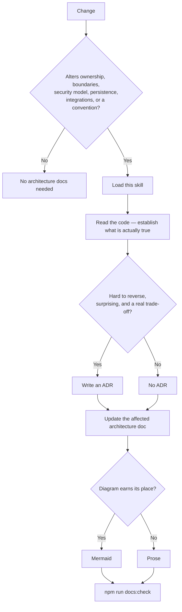

# Architecture documentation

Adapted from [`davila7/claude-code-templates`](https://github.com/davila7/claude-code-templates/blob/main/cli-tool/components/commands/documentation/create-architecture-documentation.md),
with its format menu removed. The upstream command offers a choice between C4,
Arc42, PlantUML, Structurizr and Draw.io. Offering that choice to an agent is
the drift this skill exists to prevent: the decision is already made below.

## The rule

**If a change alters architecture, the documentation changes in the same PR.**
Not afterwards, not in a follow-up issue. A doc that lags the code is worse
than no doc — people trust it and are wrong.

## Does this change need documentation?



Answering "no" at the first gate is the common and correct case. Most changes
are not architectural.

## Non-negotiables

|                 |                                                                                    |
| --------------- | ---------------------------------------------------------------------------------- |
| Prose           | Markdown                                                                           |
| Diagrams        | Mermaid, inline in the Markdown                                                    |
| Levels of zoom  | C4 concepts — context, container, component                                        |
| Decisions       | ADRs in `docs/adr/`, policy in [`docs/adr/README.md`](../../../docs/adr/README.md) |
| Source of truth | The code, the config, and recorded decisions                                       |

Do not introduce PlantUML, Structurizr, Draw.io, Arc42, or an exported image.
If the standard should change, that is itself an ADR.

## Evidence, not assumption

The failure mode for generated architecture docs is confident description of a
system that does not exist. Before writing a claim:

- **Read the implementation.** Not the old doc, not the issue — the code.
- **Verify the specific.** "Authentication performs no database read" is
  checkable. Check it, and prefer citing the test that proves it.
- **Say what is, not what was intended.** Where they differ, that gap is the
  most valuable thing you can write down.
- **Name known debt as debt.** A documented exception is a decision; a silent
  one is a trap.

If you cannot point at the thing, do not write the sentence.

## Working on existing docs

Do not regenerate a document to change part of it. These files carry reasoning
that took real argument to arrive at, and a rewrite quietly discards it.

Read it, edit the part that is now wrong, leave the rest. If a section's
reasoning no longer holds, replace the reasoning — do not delete the section
and move on.

## References

- [`structure.md`](references/structure.md) — where each document lives, and what belongs in it
- [`diagrams.md`](references/diagrams.md) — when a diagram earns its place, and how to write one that survives review
- [`adr-policy.md`](references/adr-policy.md) — when an ADR is required, and the format
- [`quality.md`](references/quality.md) — the checks, and what they will not do for you
- [`migration.md`](references/migration.md) — auditing and moving documentation that predates this standard
- [`examples.md`](references/examples.md) — worked cases: what needs a doc, what needs an ADR, and what needs neither

## Finishing

```bash
npm run docs:check
```

Runs as stage 6 of `npm run verify` and in CI: links resolve, Mermaid passes a
structural sanity check, ADRs are named and structured per policy, and every
architecture document appears in the index.

It checks facts, not prose. Passing it does not mean the document is any good —
that still needs a reader.
