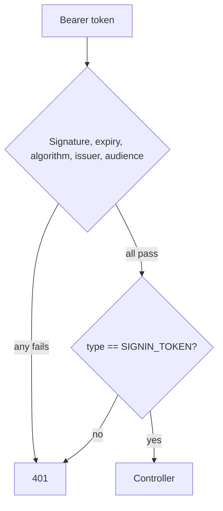

# Diagrams

Mermaid, inline in the Markdown. Never an exported image — an image cannot be
diffed, reviewed, or corrected by whoever notices it is wrong.

## When a diagram earns its place

Use one when it shows something prose states badly:

- Three or more components interacting
- A relationship crossing module boundaries
- An authentication or authorization flow
- Anything asynchronous or event-driven
- An external integration's call sequence
- A data flow worth tracing
- Infrastructure topology

## When it does not

- Two boxes and an arrow. Write the sentence.
- Restating a list. A flowchart of sequential steps is a list with extra syntax.
- Decoration. A diagram that adds nothing still has to be maintained, and will
  rot into being actively wrong.

The test: **remove it. Is anything lost?** If not, leave it out.

## Picking the type

| Showing                                | Use               |
| -------------------------------------- | ----------------- |
| Structure, dependencies, decisions     | `flowchart`       |
| An exchange over time, between parties | `sequenceDiagram` |
| A lifecycle with defined states        | `stateDiagram-v2` |
| Collections and their relationships    | `erDiagram`       |
| System boundary and externals          | `C4Context`       |

## Writing one that survives

**Label the edges.** `A --> B` says two things are connected. `A -->|"issues a
15-min access token"| B` says what actually happens.

**Show the real mechanism.** A diagram matching the happy path only is where
architecture diagrams start lying. Include the refusal:

**Keep it to one idea.** Two diagrams beat one that needs a legend.

**Quote labels containing punctuation.** `A["type == SIGNIN_TOKEN"]` — an
unquoted `(`, `[`, `{`, `,` or `:` breaks the parse, and `npm run docs:check`
will catch the unbalanced bracket but not every case.

## Verifying

`npm run docs:check` catches empty blocks, unknown diagram types, and
unbalanced brackets — a structural sanity check, **not** a Mermaid parse, so a block can pass it and still fail to render. It cannot tell you the diagram is _wrong_ — GitHub renders
Mermaid natively, so look at the rendered file in the PR before merging.
