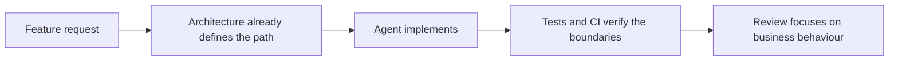
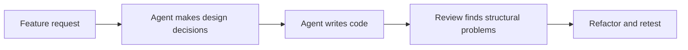
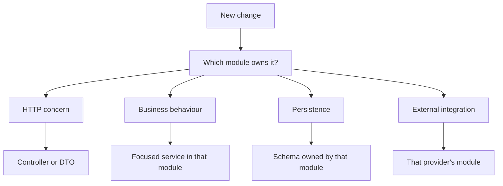

<p align="center">
  <a href="http://nestjs.com/" target="blank"></a>
</p>

[circleci-image]: https://img.shields.io/circleci/build/github/nestjs/nest/master?token=abc123def456
[circleci-url]: https://circleci.com/gh/nestjs/nest

  <p align="center">A progressive <a href="http://nodejs.org" target="_blank">Node.js</a> framework for building efficient and scalable server-side applications.</p>
    <p align="center">
<a href="https://www.npmjs.com/~nestjscore" target="_blank"></a>
<a href="https://www.npmjs.com/~nestjscore" target="_blank"></a>
<a href="https://www.npmjs.com/~nestjscore" target="_blank"></a>
<a href="https://circleci.com/gh/nestjs/nest" target="_blank"></a>
<a href="https://discord.gg/G7Qnnhy" target="_blank"></a>
<a href="https://opencollective.com/nest#backer" target="_blank"></a>
<a href="https://opencollective.com/nest#sponsor" target="_blank"></a>
  <a href="https://paypal.me/kamilmysliwiec" target="_blank"></a>
    <a href="https://opencollective.com/nest#sponsor"  target="_blank"></a>
  <a href="https://twitter.com/nestframework" target="_blank"></a>
</p>
  <!--[](https://opencollective.com/nest#backer)
  [](https://opencollective.com/nest#sponsor)-->

## Start here

**New here? Read [`docs/GUIDE.md`](docs/GUIDE.md)** — the complete A–Z guide:
getting a project (new, or this toolkit in one you already have), running it,
your first endpoint, the commit gate, and the errors you might actually hit. It
renders right here on GitHub.

```bash
pnpm install        # installs deps + sets up the Husky hooks
pnpm dev            # watch mode on http://localhost:8080 — Swagger at /api-docs
pnpm run verify     # the full quality gate; run before every commit
```

The authoritative rules are in [`AGENTS.md`](AGENTS.md). The same material is
also available as illustrated HTML pages in [`docs/guide/`](docs/guide/README.md)
for reading from disk, and as a
[hosted page](https://claude.ai/code/artifact/bccb3dc8-180b-4d22-ba6a-14bd91c77b22)
for people who do not have this repo yet — that one is private to whoever it has
been shared with, so a 404 means you need access, not that the link is broken.

## Description

[Nest](https://github.com/nestjs/nest) framework TypeScript starter repository.

## Agent-First Engineering Philosophy

> **Humans control architecture. AI agents execute within those boundaries.**

Most of the code in this repository will be written by AI agents. That changes
what documentation and structure are _for_.

Every architectural decision this repository leaves undefined is a decision an
agent has to make again, from scratch, on every task: where should this logic
live, which module owns it, may this service call that one, where does
validation belong, which tests are required, which security boundary applies.
Different agents answer differently and each answer is locally reasonable. The
result is duplicated patterns, inconsistent boundaries, drift, heavier review,
and rework — debt generated faster than anyone can pay it down.

So the decisions get made **once**, by people, and encoded in structure and
tooling. Then agents implement.



instead of:



**Clean architecture is not overhead here. It is debt that never gets
created.** A convention caught by a lint rule in two seconds costs nothing; the
same convention caught in review three days later costs a rewrite.

### The implementation contract

Before writing code, know the answers to these. They are already decided.

| Concern                | Rule                                                                                                                               |
| ---------------------- | ---------------------------------------------------------------------------------------------------------------------------------- |
| **Ownership**          | Every change has one owning module. Resolve it _before_ implementing — see [module map](docs/architecture/module-architecture.md). |
| **Controllers**        | HTTP only: route, validate, map, delegate. Never a business or persistence layer.                                                  |
| **Services**           | One focused responsibility. If a service changes for unrelated reasons, split it.                                                  |
| **Cross-module calls** | Must express a capability need. Never reach into another module's internals for convenience.                                       |
| **Persistence**        | Keep simple CRUD simple. Extract only when it is duplicated or hides business behaviour.                                           |
| **External providers** | Provider-specific code stays inside that provider's module.                                                                        |
| **Events**             | Only when the caller genuinely should not own what happens next. Do not make synchronous code event-driven without a reason.       |
| **Auth**               | Routes are authenticated by default. See [authentication](docs/architecture/security/authentication.md).                           |
| **Testing**            | Cover new behaviour at the lowest useful level; cover boundaries with integration or e2e tests.                                    |

### Where does this code go?



The full decision table is in the [module map](docs/architecture/module-architecture.md#where-does-this-change-go).

### If you are an AI agent

- **When the route is not clear, chart it first.** If making an issue
  implementation-ready would mean guessing an unresolved decision, use
  [Wayfinder](docs/guides/wayfinder.md) rather than guessing.
- **Read the architecture docs before implementing.** [Module map](docs/architecture/module-architecture.md),
  [authentication](docs/architecture/security/authentication.md), [ADRs](docs/adr/).
- **Use pnpm only.** The pinned version in `package.json#packageManager` and
  `pnpm-lock.yaml` define the dependency workflow. See [ADR 0004](docs/adr/0004-pnpm-canonical-package-manager.md).
- **Preserve module ownership.** Put code where the map says, not where it is
  convenient to reach.
- **Reuse the approved pattern** rather than inventing a parallel one.
- **Do not add abstractions without a concrete need.** No interface, factory or
  repository layer that does not remove a real coupling.
- **Do not bypass security or testing conventions.** Never silence a finding
  with `eslint-disable`, a baseline edit, or `--no-verify`.
- **Update tests whenever behaviour changes.**
- **Treat a CI failure as architecture feedback, not an obstacle.** The message
  names the rule, the offending path, and the doc that explains it. If a rule
  genuinely needs to change, that is an ADR — not a suppression.

### What humans stay responsible for

Architecture decisions, domain ownership, security boundaries, approved
integration patterns, operational constraints, and any exception to these
standards. An agent should never be redesigning these during routine feature
work — if a task seems to require it, that is the signal to stop and ask.

## Project setup

pnpm is the canonical package manager. The exact version is pinned in
`package.json`; Corepack can activate that version when pnpm is not already
available.

```bash
corepack enable
pnpm install --frozen-lockfile
```

## Compile and run the project

```bash
# development
pnpm run start

# watch mode  (`pnpm run dev` is an alias for this)
pnpm run start:dev

# production mode
pnpm run start:prod
```

## Run tests

```bash
# unit tests
pnpm test

# e2e tests
pnpm run test:e2e

# test coverage
pnpm run test:cov
```

## Code quality

Every commit passes an automated quality gate: guard rails against committed
secrets and `.env` files, ESLint plus 15 project-convention rules, a full
TypeScript check, and file-structure validation. Formatting and auto-fixable
issues are repaired and re-staged for you; anything left prints the file, the
fix, and the convention page that explains it.

```bash
pnpm run verify      # run the gate across the whole repo
pnpm run typecheck   # type errors only
pnpm run debt        # convention debt still in the baseline
claude "/fix-commit"  # have Claude fix whatever blocked your commit
```

Tests run automatically after each commit — only the suites affected by the
files you changed.

Architectural boundaries are checked too — module dependency cycles, forbidden
cross-module reads, and provider-SDK leakage:

```bash
pnpm run architecture:check
```

See [docs/quality-gate.md](docs/quality-gate.md) for the full reference,
[docs/architecture/](docs/architecture/) for the boundaries themselves, and
`.claude/skills/best-practices/` for the coding conventions.

Integrating a client against the auth API? Start at
[docs/frontend-auth-integration.md](docs/frontend-auth-integration.md).

## Guide

New to this repo? Open [docs/guide/index.html](docs/guide/index.html) — five
self-contained HTML pages covering setup, architecture, every endpoint, and the
agent skills this repo ships. No build step; open it straight from disk. See
[docs/guide/README.md](docs/guide/README.md) for what each page holds.

## Deployment

When you're ready to deploy your NestJS application to production, there are some key steps you can take to ensure it runs as efficiently as possible. Check out the [deployment documentation](https://docs.nestjs.com/deployment) for more information.

If you are looking for a cloud-based platform to deploy your NestJS application, check out [Mau](https://mau.nestjs.com), our official platform for deploying NestJS applications on AWS. Mau makes deployment straightforward and fast, requiring just a few simple steps:

```bash
pnpm add --global @nestjs/mau
mau deploy
```

With Mau, you can deploy your application in just a few clicks, allowing you to focus on building features rather than managing infrastructure.

## Resources

Check out a few resources that may come in handy when working with NestJS:

- Visit the [NestJS Documentation](https://docs.nestjs.com) to learn more about the framework.
- For questions and support, please visit our [Discord channel](https://discord.gg/G7Qnnhy).
- To dive deeper and get more hands-on experience, check out our official video [courses](https://courses.nestjs.com/).
- Deploy your application to AWS with the help of [NestJS Mau](https://mau.nestjs.com) in just a few clicks.
- Visualize your application graph and interact with the NestJS application in real-time using [NestJS Devtools](https://devtools.nestjs.com).
- Need help with your project (part-time to full-time)? Check out our official [enterprise support](https://enterprise.nestjs.com).
- To stay in the loop and get updates, follow us on [X](https://x.com/nestframework) and [LinkedIn](https://linkedin.com/company/nestjs).
- Looking for a job, or have a job to offer? Check out our official [Jobs board](https://jobs.nestjs.com).

## Support

Nest is an MIT-licensed open source project. It can grow thanks to the sponsors and support by the amazing backers. If you'd like to join them, please [read more here](https://docs.nestjs.com/support).

## Stay in touch

- Author - [Kamil Myśliwiec](https://twitter.com/kammysliwiec)
- Website - [https://nestjs.com](https://nestjs.com/)
- Twitter - [@nestframework](https://twitter.com/nestframework)

## License

Nest is [MIT licensed](https://github.com/nestjs/nest/blob/master/LICENSE).
