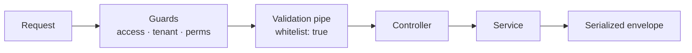

# The Complete Guide — NestJS Backend Boilerplate

> One document, A–Z. Read it once and you will know how to get a project from
> this boilerplate, how to run it, how to ship your first endpoint, and what the
> commit gate will ask of you. Written so an intern and a senior both get it.

---

## 1. What is this? (in one line)

A NestJS + MongoDB starting point where authentication, authorization, email,
media, payments and chat are already wired in — and where code quality is
enforced **automatically by tools**, not by remembering rules.

You clone it, pick the modules you want, and you already have a guarded project.

---

## 2. Why it exists

| Problem on a normal project                    | How this boilerplate solves it                                            |
| ---------------------------------------------- | ------------------------------------------------------------------------- |
| Every project is set up differently            | One structure, generated from one template                                |
| "Where does this code go?" is re-decided daily | Every kind of change has a documented owner, and the gate enforces it     |
| Conventions live in people's heads             | 24 custom ESLint rules encode them; violations show up in your editor     |
| Unused modules rot in the repo                 | The setup wizard removes what you did not pick — code, env keys, packages |
| Old projects can't adopt new standards         | Existing violations are baselined; only new code is held to the rules     |

It is also **agent-first**: most code here will be written by AI agents, and
every architectural question left open is one an agent answers differently on
every task. So the answers are decided once, written in
[`docs/architecture/`](architecture/README.md), and enforced mechanically.

---

## 3. Getting a repo — pick your path

| You are…                                      | Go to                                               |
| --------------------------------------------- | --------------------------------------------------- |
| Starting a **new** service                    | [§3.1 A new service](#31-a-new-service)             |
| Adding this to a project you **already have** | [§3.2 An existing project](#32-an-existing-project) |

Both need `gh auth login`, Node 20+, and read access to this repo. The repo is
private; `gh` authenticates every fetch, so anyone without access gets a 404.

### 3.1 A new service

**Step 1 — get the template.** Clone under the name you want and convert the
clone in place:

```bash
git clone https://github.com/Gok-boilerplates/nestjs-backend.git my-api
cd my-api
node scripts/setup.mjs --in-place
```

Or skip cloning entirely — this fetches the template into a temp folder, runs
the wizard, and deletes itself:

```bash
bash <(gh api repos/Gok-boilerplates/nestjs-backend/contents/create.sh \
  -H "Accept: application/vnd.github.raw") my-api
```

> [!WARNING]
> Use `bash <(…)`, never `… | bash`. Piping makes the script itself stdin, so
> the wizard's prompts read end-of-file and it silently answers with defaults.

**Step 2 — pick your modules.** Arrow keys move, space toggles, enter accepts.
The first five are locked; the cursor skips them.

```text
  Which modules do you want?
  ↑↓ move · space toggle · enter accept

    ◉ auth                JWT access/refresh, OTP, password reset  (always included)
    ◉ user                User accounts and profile management     (always included)
    ◉ authorization       CASL policies and permission guards      (always included)
    ◉ email               Transactional email + Handlebars         (always included)
    ◉ media               S3 upload/download and presigned URLs    (always included)

  › ◉ stripe              Stripe — cards, invoices, payments, subscriptions
    ○ paypal              PayPal — invoices, payments, subscriptions
    ◉ notifications       In-app notifications (feed, read state)
    ○ chat                Realtime chat (Socket.IO gateway, rooms)
    ○ onesignal           Push notifications via OneSignal
    ○ platform-assistant  AI assistant (OpenAI, conversation store)
```

**Step 3 — pick how it sends email.** A radio, not a checkbox: `EMAIL_PROVIDER`
activates one at runtime, so keeping two only means carrying an unused SDK.

```text
  How should this project send email?

  › ◉ brevo     Brevo — the default; one API key (EMAIL_API_KEY)
    ○ ses       AWS SES — reuses your AWS_* credentials; sender must be verified
    ○ sendgrid  SendGrid — SENDGRID_API_KEY, with its own sender override
```

Already know what you want? Skip both screens with
`--modules=stripe,chat --email=ses --yes`, or preview the plan with `--dry-run`.

**Step 4 — install and run.**

```bash
git remote set-url origin <your-new-repo>
pnpm install            # writes a fresh lockfile — commit it
cp .env.example .env    # then fill in the values (see §5)
pnpm run verify
pnpm dev
```

The lockfile is deliberately removed when modules are dropped — it still pinned
the removed packages, and CI's `pnpm install --frozen-lockfile` rejects a
mismatch rather than reconciling it.

#### What you can leave out

Which modules are optional is not a preference. Five are imported by other
modules, so removing one gives you a project that does not compile.

| Module               | Default | Why it is (or isn't) core           |
| -------------------- | ------- | ----------------------------------- |
| `auth`               | core    | Imported by six modules             |
| `user`               | core    | Imported by five                    |
| `media`              | core    | Imported by auth, email, user       |
| `email`              | core    | Imported by auth, user              |
| `authorization`      | core    | Imported by stripe, user            |
| `stripe`             | on      | Optional                            |
| `notifications`      | on      | Optional                            |
| `paypal`             | off     | Optional                            |
| `chat`               | off     | Optional                            |
| `onesignal`          | off     | Optional — pulls in `notifications` |
| `platform-assistant` | off     | Optional                            |

Dropping a module removes its folder, its `#region` block in `app.module.ts`,
its keys in `config.constant.ts` and `.env.example`, its half of the seed
script, and its npm dependencies. The design is recorded in
[ADR 0005](adr/0005-region-anchored-module-generator.md).

### 3.2 An existing project

Nothing you have shipped starts failing. Existing violations are recorded in two
baseline files, so the rules bind new code only — and the whole export is undone
by one git command.

**Step 1 — start from a clean tree.** The installer refuses otherwise, so that
`git checkout . && git clean -fd` can always undo it.

```bash
cd ~/work/your-project
git status
```

**Step 2 — run the installer.** Here `| sh` is correct; this script asks nothing.

```bash
gh api -H "Accept: application/vnd.github.raw" \
  repos/Gok-boilerplates/nestjs-backend/contents/scripts/install-toolkit.sh | sh
```

What it does to files you already have:

| Your file                | What happens                                                           |
| ------------------------ | ---------------------------------------------------------------------- |
| `eslint.config.mjs`      | Kept verbatim as `eslint.config.project.mjs`; a wrapper adds the rules |
| `.husky/pre-commit` etc. | Kept; a line calling the gate is appended                              |
| `.claude/skills/*`       | Kept; only missing files are added                                     |
| `package.json` scripts   | Kept; conflicts are reported, never overwritten                        |

**Step 3 — install and wire up the hooks.** Use whatever package manager your
project uses; the installer prints the matching commands, including the right
husky call for your version (`husky` on v9, `husky install` before).

```bash
npm install
npx husky
```

**Step 4 — record what is already there.** Not optional: skip it and a codebase
with months of history opens with hundreds of errors. Real numbers from a
three-month-old project: 163 architecture and 209 lint violations, recorded in
about two seconds.

```bash
npm run architecture:accept    # accept, not baseline — see §9
npm run lint:baseline          # needs ESLint 9.24+
```

**Step 5 — check the gate, and check the rules actually fire.**

```bash
npm run verify
npm run debt       # the recorded debt, by rule
```

> [!IMPORTANT]
> If `debt` lists no `nestjs/*` rules, stop. The rules were copied but never
> loaded — the gate would report green while enforcing nothing.

Finally, read `.claude/skills/best-practices/` — it describes **this**
boilerplate, not your codebase. Edit it to match what your project actually does.

---

## 4. Getting it running

You need Node 22, a reachable MongoDB, and pnpm. No Docker Compose, queue or
cache to start.

```bash
corepack enable
pnpm install --frozen-lockfile   # also installs the Husky hooks
cp .env.example .env
openssl rand -base64 48           # paste into JWT_SECRET
pnpm run start:dev
```

- Listens on `PORT`, default **8080**. CORS is open in development.
- Swagger UI: **http://localhost:8080/api-docs** — paste an access token once and
  it persists between reloads.
- Need data? `pnpm run seed`.

> [!WARNING]
> The app refuses to boot on a weak secret. `validateAuthEnv` rejects a
> `JWT_SECRET` under 32 characters at startup — a short HS256 key is
> brute-forceable offline, and every token it signed would be forgeable.

Config resolves `.env.<NODE_ENV>` first, then `.env`, with `NODE_ENV` defaulting
to `dev`. A stray `.env.dev` silently outranks your `.env` — check that first
when a value looks ignored.

---

## 5. Environment variables

Only `JWT_SECRET` and `EMAIL_PROVIDER` are checked at boot; everything else fails
at the point of use, so an empty Stripe key costs nothing until something calls
Stripe. A generated project's `.env.example` contains exactly the keys its
modules need.

| Variable                                      | Needed for  | Notes                                                   |
| --------------------------------------------- | ----------- | ------------------------------------------------------- |
| `MONGODB_URI`                                 | Everything  | No app without it                                       |
| `JWT_SECRET`                                  | Auth        | Boot-checked, ≥ 32 chars, HS256                         |
| `NODE_ENV`                                    | Config      | Selects `.env.<value>`; defaults to `dev`               |
| `PORT`                                        | HTTP        | Defaults to 8080                                        |
| `FRONTEND_URL`                                | Email links | Base for reset and verification links                   |
| `OTP_SECRET`                                  | Auth        | Signup and password-reset OTPs                          |
| `TEMPLATES_PATH`                              | Email       | Where Handlebars templates are read from                |
| `EMAIL_PROVIDER`, `EMAIL_SENDER`              | Email       | Which provider sends, and from where — boot-checked     |
| `AWS_*`                                       | Media, SES  | S3 credentials; also used by the SES email provider     |
| `STRIPE_SECRET_KEY`, `STRIPE_WEBHOOK_SECRET`… | Stripe      | The webhook secret is what makes the webhook route safe |
| `PAYPAL_*`                                    | PayPal      | `PAYPAL_ENVIRONMENT` switches sandbox vs live           |
| `ONESIGNAL_*`                                 | Push        |                                                         |
| `OPENAI_*`, `LLM_PROVIDER`                    | Assistant   | Defaults: `openai`, `gpt-4.1-mini`                      |

Never read `process.env` directly — `nestjs/no-process-env` blocks it. Read config
through `ConfigService` with a key from the `CONFIG` enum in
`src/constants/config.constant.ts`.

Email provider details, including what each one costs you, are in
[`architecture/integrations/email-providers.md`](architecture/integrations/email-providers.md).

---

## 6. The commands you'll actually use

| Command                       | Does                                               |
| ----------------------------- | -------------------------------------------------- |
| `pnpm run start:dev`          | Watch mode — your default (`pnpm dev` is an alias) |
| `pnpm run build`              | `nest build`                                       |
| `pnpm test`                   | Unit specs (`*.spec.ts` under `src/`)              |
| `pnpm run test:e2e`           | End-to-end suites in `test/`                       |
| `pnpm run test:e2e:auth`      | Just the auth contract — no database needed        |
| `pnpm run verify`             | The whole six-stage gate. Run before pushing       |
| `pnpm run lint`               | ESLint `--fix` plus Prettier                       |
| `pnpm run typecheck`          | `tsc --noEmit`                                     |
| `pnpm run debt`               | What convention debt is still baselined            |
| `pnpm run architecture:check` | Module cycles, foreign schema reads, SDK leakage   |
| `pnpm run docs:check`         | Link resolution, Mermaid sanity, ADR structure     |

---

## 7. Anatomy of a module

Every feature module has the same skeleton, and the gate checks that folder
names and file suffixes agree. `user` is the reference implementation — when in
doubt, copy how it does something.

```text
src/modules/user/
├── user.module.ts          wiring only — imports, providers, exports
├── user.controller.ts      HTTP: route, validate, map, delegate
├── user.service.ts         business behaviour + Mongoose calls
├── user.schema.ts          the collection this module owns
├── README.md               required for every new module
├── dto/                    request shapes, one class per file, ending in `Dto`
├── policies/               CASL rules about this module's records
└── constants/
    └── api-response/       every user-facing message, as an enum
```



The validation pipe is global with `whitelist: true`, so any field your DTO does
not declare is deleted before your handler runs — a security property, not just
tidiness.

**Rules worth knowing before you write anything**

- Controllers never touch a model (`nestjs/no-db-in-controller`).
- No `index.ts` barrel files.
- Cross-module imports are absolute — `src/modules/...`, never `../../`.
- Never import another module's schema; call its service.
- User-facing strings come from an `api-response` enum, not literals.
- Use `@GetUser()`, not `@Req()`.
- A module that needs another module's service **imports that module** — never
  lists the service in its own `providers`. A re-provided copy has to satisfy all
  its dependencies locally, and stops the app booting the day it gains one.

---

## 8. Your first endpoint

A worked example: a guarded `GET /users/:id/summary`. Every step exists because a
gate stage will ask for it.

**1. Messages go in an enum** (`nestjs/no-hardcoded-message`):

```ts
// src/modules/user/constants/api-response/user.response.ts
export enum USER_RESPONSE {
  SUMMARY_FETCHED = 'User summary fetched successfully',
  NOT_FOUND = 'User not found',
}
```

**2. The DTO** — every field needs `@ApiProperty()` _and_ a validator; the class
ends in `Dto`:

```ts
// src/modules/user/dto/user-summary-query.dto.ts
export class UserSummaryQueryDto {
  @ApiProperty({ required: false, example: '30d' })
  @IsOptional()
  @IsIn(['7d', '30d'])
  window?: string;
}
```

**3. Behaviour in the service** — errors through `SerializeHttpError`:

```ts
// src/modules/user/user.service.ts
async getSummary(id: string, ability: AppAbility) {
  const user = await this.userModel.findById(id).lean();
  if (!user) return SerializeHttpError(null, 404, USER_RESPONSE.NOT_FOUND);
  // the record-level check the route guard could not do
  this.authorization.assertCan(ability, Action.Read, subject(USER_SUBJECT, user));
  return buildSummary(user);
}
```

**4. Wire the route** — authentication is already on; you add the permission:

```ts
// src/modules/user/user.controller.ts
@Get(':id/summary')
@RequirePermissions({ action: Action.Read, subject: USER_SUBJECT })
async summary(
  @Param('id') id: string,
  @Query() query: UserSummaryQueryDto,
  @GetAbility() ability: AppAbility,
) {
  const data = await this.userService.getSummary(id, ability);
  return SerializeHttpResponse(data, 200, USER_RESPONSE.SUMMARY_FETCHED);
}
```

**5. Cover it with a policy test** — allow, deny, ownership, elevated role,
unknown role. `src/modules/user/policies/user.policy.spec.ts` is the reference.

A **new module** additionally needs a `README.md` and registration in
`AppModule` — and a check of the [module map](architecture/module-architecture.md)
first, to be sure the behaviour does not already have an owner.

---

## 9. The commit gate

Hooks install themselves on `pnpm install`. Every stage runs even after an
earlier one fails, so a blocked commit shows the complete list in one pass.

| #   | Stage                   | Checks                                                                         |
| --- | ----------------------- | ------------------------------------------------------------------------------ |
| 1   | Guard rails             | Staged `.env` files, hard-coded credentials, files over 1 MB, conflict markers |
| 2   | Lint & conventions      | `eslint --fix` + Prettier, then TypeScript correctness and 24 `nestjs/*` rules |
| 3   | Type safety             | `tsc --noEmit` across the project                                              |
| 4   | Structure & naming      | File/folder naming, folder–suffix agreement, README for new modules            |
| 5   | Architecture boundaries | Module cycles, foreign schema reads, SDK leakage — ratcheted                   |
| 6   | Documentation           | Links resolve, Mermaid sanity, ADR naming, index completeness                  |

Tests run **after** the commit on purpose — a commit is a local checkpoint, and
making every one wait on Jest is what pushes people toward `--no-verify`.

### The 24 convention rules

ESLint rules rather than a bespoke script, so violations show up live in your
editor.

| Group             | Rules                                                                                                                                                                                                      |
| ----------------- | ---------------------------------------------------------------------------------------------------------------------------------------------------------------------------------------------------------- |
| Responses         | `no-raw-http-exception`, `return-serialize-http-error`, `no-hardcoded-message`                                                                                                                             |
| DTOs & Swagger    | `require-api-property`, `require-dto-validation`, `dto-class-suffix`, `require-api-tags`, `require-api-bearer-auth`                                                                                        |
| Controllers       | `no-db-in-controller`, `no-raw-request-decorator`                                                                                                                                                          |
| Schemas           | `require-schema-timestamps`, `require-schema-exports`                                                                                                                                                      |
| Hygiene           | `no-process-env`, `no-cross-module-relative-import`, `no-barrel-file`, `no-focused-tests`                                                                                                                  |
| Auth architecture | `no-direct-jwt-verify`, `no-direct-jwt-sign`, `no-db-in-access-auth`, `no-legacy-auth-guard`, `no-raw-organization-header`, `no-manual-bearer-parsing`, `no-parallel-authorization`, `one-access-strategy` |

The auth-architecture rules ban patterns that are a way **around** the guards
rather than a use of them. In an adopted project, those are the suppressions to
pay down first.

### The baselines

`eslint-suppressions.json` and `architecture-baseline.json` record violations
that existed before the gate. They are ratchets: new code must be clean,
pre-existing violations do not block unrelated work, and the lists only shrink.

```bash
pnpm run debt                    # what is still baselined
pnpm run lint:baseline:prune     # drop suppressions you have fixed
pnpm run architecture:baseline   # re-record what is left after a fix
```

> [!WARNING]
> `--suppress-all` and `architecture:accept` are for the **first** adoption only.
> Run them to make a later failure go away and they re-suppress your new
> violations along with the old — exactly what the ratchet exists to prevent.

### When it blocks you

Every finding names the file, the line, the fix, and the convention page.

```bash
claude "/fix-commit"   # have Claude apply the fixes
pnpm run verify        # or work through it yourself
```

There are deliberately almost no escape hatches. `--no-verify` skips the hooks,
but CI runs the same gate — it buys minutes, not permission. A rule that is
genuinely wrong for a case gets changed in `tools/eslint-rules/`, with an ADR,
not disabled inline.

---

## 10. The response envelope

Every response is wrapped by `src/utils/serializer.ts`:

```ts
interface Serialized<T> {
  data: T;
  status: number;
  message: string;
}
SerializeHttpResponse(data, 200, MESSAGE); // returns the envelope
SerializeHttpError(null, 404, MESSAGE); // throws an HttpException with it
```

> [!NOTE]
> Only the auth module returns real HTTP status codes today. Elsewhere a failure
> can come back as HTTP 200 with the real status in `body.status`. That is tracked
> debt — the auth module shows the intended direction.

---

## 11. Testing

| Kind                   | Lives in                          | Notes                                                                                |
| ---------------------- | --------------------------------- | ------------------------------------------------------------------------------------ |
| Unit                   | `src/**/*.spec.ts`                | `pnpm test`                                                                          |
| Auth contract          | `test/auth/`                      | No database; real HTTP via Supertest                                                 |
| Authorization contract | `test/authorization/`             | No database; asserts zero user-collection reads                                      |
| Toolkit adoption       | `scripts/export-toolkit.spec.mjs` | `pnpm run toolkit:test` — adopts into a fake project and checks the gate works there |

The authorization e2e asserts the user collection is read **zero** times across
an authenticated request — so if authentication ever starts hitting the database
again, however it is spelled, the test fails.

---

## 12. When it goes wrong

Each of these came out of a real setup. Search this page for the message your
terminal printed.

| Symptom                                                  | Cause and fix                                                                                             |
| -------------------------------------------------------- | --------------------------------------------------------------------------------------------------------- |
| App exits at startup about the secret                    | `JWT_SECRET` missing or under 32 chars. `openssl rand -base64 48`                                         |
| `EMAIL_PROVIDER="…" is not available in this build`      | Names a provider this project was generated without. Use the one in `.env.example`, or leave it blank     |
| `Nest can't resolve dependencies of the EmailService`    | A module lists `EmailService` in its `providers`. Import `EmailModule` instead                            |
| `EADDRINUSE: address already in use :::8080`             | Another process holds the port. `lsof -nP -iTCP:8080 -sTCP:LISTEN`, then kill it                          |
| `Cannot find module '…/dist/main'` after a clean compile | Stale build cache outside `dist/`. `rm -f tsconfig.build.tsbuildinfo`                                     |
| An env value seems ignored                               | A `.env.<NODE_ENV>` is shadowing `.env`                                                                   |
| A field you sent never reaches the handler               | `whitelist: true` stripped it. Declare it in the DTO, with both decorators                                |
| 401 on a route you expected to be open                   | Authentication is on by default. Add `@Public()` — visibly, and only where it is genuinely pre-credential |
| Role change hasn't taken effect                          | Abilities come from token claims; it applies when the access token expires (up to 15 minutes)             |
| `163 violation(s) are not in the baseline`               | First adoption: run `architecture:accept`, not `architecture:baseline`                                    |
| `Invalid option '--suppress-all'`                        | ESLint older than 9.24. Upgrade, then re-run `lint:baseline`                                              |
| `No files matching the pattern "test/**/*.ts"`           | Old toolkit copy assumed a `test/` dir. Re-run the installer                                              |
| `ERR_PNPM_IGNORED_BUILDS`                                | A dependency wants an install script. `pnpm approve-builds`, then record it in `pnpm-workspace.yaml`      |
| `husky - Usage: husky install [dir]`                     | Husky 8. The command is `husky install`, not `husky`                                                      |
| Hooks are not running                                    | Check `.husky/pre-commit` calls `node scripts/hooks/pre-commit.mjs`, and `git config core.hooksPath`      |
| Wizard never asked anything                              | You piped the bootstrap. Use `bash <(gh api …)`                                                           |
| Two lockfiles in the repo                                | Pick one package manager, delete the other lockfile, commit                                               |

---

## 13. Where to go next

- [`docs/architecture/`](architecture/README.md) — module map, ownership, auth
  and authorization models, dependency rules, and the debt register.
- [`docs/adr/`](adr/README.md) — five recorded decisions and why they were made.
- [`AGENTS.md`](../AGENTS.md) — the enforcement-level rules, short by design.
- [`docs/agents/skills-guide.md`](agents/skills-guide.md) — every agent skill
  and when it fires.
- [`docs/guide/`](guide/README.md) — the same material as illustrated HTML pages,
  for reading from disk.
