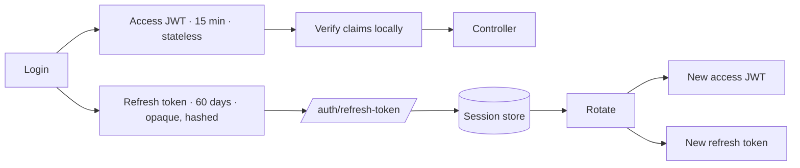

# ADR 0001 — Authentication boundaries

- **Status:** Accepted
- **Date:** 2026-08-25
- **Tracking issue:** [#2](https://github.com/Gok-boilerplates/nestjs-backend/issues/2)
- **Supersedes:** the mixed guard/strategy implementation that shipped before M1

## Context

Authentication in this codebase had grown into several overlapping
implementations rather than one:

- A Passport `JwtStrategy` was registered but no route used it. Protected
  routes went through a hand-written `JwtAuthGuard` that parsed the
  `Authorization` header, called `JwtService.verify()`, loaded the user from
  MongoDB, and assembled `request.user` itself.
- That guard checked signature and expiry and nothing else. The application
  signed several JWT purposes with one secret, so a password-reset token
  cleared the same boundary as an access token and authenticated any protected
  route for its 30-minute life.
- The password-reset endpoint verified a reset token and then selected the
  account to update from a separate `email` field in the request body — proof
  of authority and the identity it authorized came from different places.
- Reset tokens had no consumption state, so a leaked one worked until expiry,
  repeatedly.
- Access tokens lived for 7 days. Refresh-token support existed behind a flag
  that was off, which left logout, password change, and revocation with no
  defined meaning.
- `JwtAuthGuard` and `RolesGuard` each loaded the user, so a role-protected
  request cost two reads before reaching the handler.
- `JwtAuthGuard` copied the caller-supplied `x-organization-id` header onto the
  request, and `GetOrganizationId` handed it to controllers as though it were
  established context.

The through-line is that the trust boundary was not in one place, so no single
file could be read to answer "what makes a request authenticated here?".

## Decision

### 1. One authentication path

Passport is the only access-token implementation. `JwtStrategy` verifies;
nothing else does. The custom `JwtAuthGuard` is deleted, and
`nestjs/no-direct-jwt-verify` fails the build if a second verification call
appears.

### 2. Authenticated by default

`JwtAccessGuard` is registered globally via `APP_GUARD`. Every route is
protected unless it carries `@Public()`.

The inversion is the point. Under the old model, forgetting `@UseGuards`
shipped an open endpoint and nothing said so — which is exactly what had
happened to three PayPal controllers, where the guard sat commented out.
Forgetting `@Public()` returns 401 on an endpoint that should be open, and
someone notices within minutes.

### 3. One signing boundary

`TokenService` is the only place an access token is minted. Signing and
verification options are defined together so they cannot drift apart —
particularly not in the permissive direction, where verification accepts more
than signing produces. `nestjs/no-direct-jwt-sign` enforces it.

### 4. The full trust boundary, every time

An access token is accepted only if **all** of the following hold:

| Check                                | Enforced by                             |
| ------------------------------------ | --------------------------------------- |
| Signature                            | passport-jwt, `secretOrKey`             |
| Not expired                          | passport-jwt, `ignoreExpiration: false` |
| Algorithm is `HS256`                 | passport-jwt, `algorithms` allow-list   |
| Issuer is `nestjs-backend`           | passport-jwt, `issuer`                  |
| Audience is `nestjs-api`             | passport-jwt, `audience`                |
| Purpose is `SIGNIN_TOKEN`            | `isAccessTokenClaims()`                 |
| `sub`, `email`, known `role` present | `isAccessTokenClaims()`                 |

The last two are runtime checks, not type annotations. A decoded JWT payload
is attacker-influenced input; `as AccessTokenClaims` would assert a shape
nothing had verified.

### 5. Stateless access, stateful sessions

The access token carries the authorization claims it needs and is validated
with **zero MongoDB reads**. Long-lived continuity and revocation live in the
refresh session instead.

**The trade-off, stated plainly:** a role change, suspension, or deletion does
not take effect until the caller's current access token expires — at most 15
minutes. That window is the price of the property, and the 15-minute TTL is
what makes the price acceptable. Anything needing immediate effect must revoke
the refresh sessions **and** accept the same bounded window, or add an explicit
revocation cache — not reintroduce a per-request user lookup.

Where account state _is_ re-read is the refresh endpoint, because that is the
point at which credentials would otherwise be renewed.

**On immediate revocation: explicitly not required.** This product has no
requirement to cut off an in-flight access token faster than its expiry, so no
revocation cache is built — an unused mechanism is one that rots untested. The
session id travels in the token as `sid` so that such a check has an obvious
place to hook in later; nothing consults it on the request path today, by
design. If a requirement for sub-15-minute revocation appears, add a
revocation cache keyed on `sid` and amend this ADR — do **not** reintroduce a
per-request user lookup, which is the thing this decision exists to remove.

**`email` is never an authorization key.** It is carried for display and
logging only. Authorization reads `role` (and, for tenancy, verified
membership); addresses change and are not identifiers.

### 6. Refresh tokens rotate, and reuse is treated as theft

Refresh tokens are opaque random values stored only as SHA-256 digests. Each
refresh retires the presented token and issues a new one, in a single
conditional update so concurrent requests cannot both rotate.

A rotated token presented again means a second copy exists — a legitimate
client discards its own the moment it trades it in. Every session for that user
is revoked.

### 7. Password reset is a one-time capability, not a JWT

Reset credentials are opaque random tokens stored as digests with `userId`,
`expiresAt`, and `usedAt`. Consumption is one atomic conditional update.

Two properties follow, and both were previously absent:

- **Identity comes from the credential.** The target account is read from the
  stored record. It is not a request field, so a token issued for one account
  cannot be pointed at another.
- **Exactly one use.** A replayed or concurrently-submitted token finds nothing
  left to claim.

JWTs are the wrong tool here: single-use and immediate invalidation _are_
server-side state, which a stateless token cannot express.

### 8. Authentication, authorization, and tenancy are separate

| Boundary             | Question                           | Owner                            | Reads the database?            |
| -------------------- | ---------------------------------- | -------------------------------- | ------------------------------ |
| Authentication       | Who is this caller?                | `JwtStrategy` + `JwtAccessGuard` | Never                          |
| Role authorization   | May this principal do this?        | `RolesGuard`                     | Never — reads the `role` claim |
| Tenant authorization | May they act in this organization? | `OrganizationAccessGuard`        | Yes, deliberately              |

Membership is per-user mutable state that a short-lived token cannot speak for,
so the tenant guard does read it — on its own, well after identity is settled.

A caller-supplied `x-organization-id` is **input**. The guard is what turns it
into authorized context, and it is the only writer of `request.organizationId`.
`@GetOrganizationId()` refuses rather than returning `undefined` when that
context is absent, because an empty tenant filter silently widens a scoped
query to everything.

### 9. 401 and 403 mean different things

- **401** — no identity, or an untrustworthy one. Re-authenticating may help.
- **403** — identity established, action not permitted. Re-authenticating
  cannot help, and saying 401 would send the client somewhere useless.

### 10. Startup fails on unusable signing configuration

A missing or short `JWT_SECRET` means every token the process issues is
forgeable. `validateAuthEnv` runs at `ConfigModule` load and refuses to boot.

## Consequences

**Gained**

- One place to audit, and one place a fix has to land.
- Protected-by-default routing; three previously-open PayPal controllers are
  now covered without a code change to them.
- Reset tokens cannot authenticate API requests, cannot reset another account,
  and cannot be replayed.
- Zero database reads on the authenticated request path. Six modules stopped
  registering the `User` model, which they only ever needed to satisfy the old
  guard's constructor.
- A MongoDB outage no longer invalidates otherwise-valid access tokens.
- Logout, logout-all-devices, password change, and password reset have defined
  revocation semantics.

**Accepted costs**

- Role and status changes lag by up to the access-token TTL (15 minutes).
- Clients must implement refresh. Access tokens now expire in minutes, and the
  login response shape changed — see the breaking-change note in
  [`docs/architecture/security/authentication.md`](../architecture/security/authentication.md).
- The tenant guard costs one indexed read on tenant-scoped routes.

## Prohibited patterns

Each is enforced by a lint rule, and each was real code in this repository:

| Pattern                                                | Rule                                |
| ------------------------------------------------------ | ----------------------------------- |
| Calling `JwtService.verify()` outside the strategy     | `nestjs/no-direct-jwt-verify`       |
| Calling `JwtService.sign()` outside `TokenService`     | `nestjs/no-direct-jwt-sign`         |
| Injecting a model into a strategy or access/role guard | `nestjs/no-db-in-access-auth`       |
| Referencing the deleted `JwtAuthGuard`                 | `nestjs/no-legacy-auth-guard`       |
| Reading `x-organization-id` outside its guard          | `nestjs/no-raw-organization-header` |
| Parsing the `Authorization` header by hand             | `nestjs/no-manual-bearer-parsing`   |
| Adding a second Passport JWT strategy                  | `nestjs/one-access-strategy`        |
