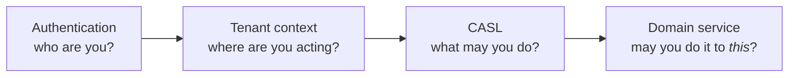

# ADR 0003 — CASL as the canonical authorization engine

- **Status:** Accepted
- **Date:** 2026-08-25
- **Tracking issue:** [#19](https://github.com/Gok-boilerplates/nestjs-backend/issues/19)
- **Builds on:** [ADR 0001](./0001-authentication-boundaries.md)

## Context

After M1 the repository had authentication, role checks, and tenant
authorization — but no model for permissions. `RolesGuard` answered one
question: does this caller hold one of these roles?

Two things it could not do.

**It could not express a rule about the record.** "A user may edit their own
profile" is not a role, so it lived as a special case in the controller
(`PATCH /users/me`, separate from `PATCH /users/:id`) rather than as a rule.

**It put the policy in the routes.** `@Roles(OWNER, ADMIN)` appeared on four
handlers in `user.controller.ts` alone. "Who may update a user?" had no single
answer — it had four, and changing it meant finding all of them and hoping.

Left alone, each new feature would answer these again: another guard, another
inline ownership check, another role list. That is the parallel-authorization
drift this repository already prevents for documentation and module
boundaries.

## Decision

[CASL](https://casl.js.org) is the permissions engine, wrapped by an
`authorization` module that owns the _mechanism_ while domain modules own the
_rules_.



| Owns                                                | Where                        |
| --------------------------------------------------- | ---------------------------- |
| Ability construction, guard, decorators, assertions | `src/modules/authorization/` |
| What each role may do to a user                     | `src/modules/user/policies/` |

Controllers declare semantics — `@RequirePermissions({ action: Action.Update,
subject: USER_SUBJECT })` — never roles. Roles are an input to policies and
appear nowhere else.

### The two-stage check

The route guard runs before anything is loaded, so it can only answer
questions about the caller. Anything about the record is asked afterwards, by
the service that loaded it:

```ts
@RequirePermissions({ action: Action.Read, subject: USER_SUBJECT })  // guard
findOne(@Param('id') id: string, @GetAbility() ability: AppAbility) {
  return this.userService.findOneAuthorized(id, ability);           // record
}
```

This is not belt-and-braces. **CASL's name-only check ignores conditions**:

```ts
can('read', 'User', { _id: 'me' });
ability.can('read', 'User'); // true  — no record to test
ability.can('read', subject('User', { _id: 'x' })); // false — record excluded
```

A caller who may read only themselves therefore passes any guard that checks
the subject _name_. Without the second stage, granting "read your own profile"
would silently grant "read every profile". Asserted in
`user.policy.spec.ts`, under _the coarse-check trap_.

### Stateless, like authentication

`PermissionsGuard` builds the ability from token claims and already-authorized
tenant context. It performs no database read — the same reasoning as ADR 0001
§5, and with the same consequence: a role change takes effect when the current
access token expires, within 15 minutes.

## Alternatives rejected

**Keep `@Roles`.** Free, and already there. Rejected: it cannot express
ownership, and it scatters policy across controllers. Both problems were
already visible in `user.controller.ts`.

**Hand-rolled policy functions.** No dependency, full control. Rejected: we
would rebuild conditions, subject detection and rule composition, badly, and
every project adopting this kit would get a bespoke system it has to learn.

**Casbin.** More powerful, model-file driven. Rejected: the policy lives in a
`.conf` DSL rather than in TypeScript beside the domain, which is the wrong
trade for a starter kit where the rules are small and the readers are
TypeScript developers — and agents.

**Open Policy Agent.** Right answer at organisational scale, wrong shape here:
a separate service and a second language for four routes.

## Consequences

**Gained.** One answer to "who may do this?", in one policy file per module.
Ownership expressed as a rule rather than a duplicated route. Controllers that
read as intent. New modules add permissions without touching the authorization
module.

**Accepted.** A dependency, and a real concept to learn — abilities,
subjects, conditions. The two-stage check is a genuine sharp edge: a developer
who adds a route guard and forgets the record-level assertion has widened
access without noticing. That is mitigated by documentation, the reference
implementation in `user`, and the test that pins the behaviour — but not
eliminated, and it is the main cost of this decision.

Role changes still lag by up to the access-token TTL, inherited from ADR 0001.

**Not decided here.** Dynamic, database-managed permissions are out of scope;
policies are code. `@casl/mongoose` for permission-aware query scoping is
worth evaluating separately.

## Migration

`@Roles` and `RolesGuard` are deprecated, not deleted — an adopter's own
routes keep working while they migrate. Nothing in `src/` still uses them;
`src/modules/user/` is the worked example. Route-by-route steps are in
[`docs/guides/permissions.md`](../guides/permissions.md).
