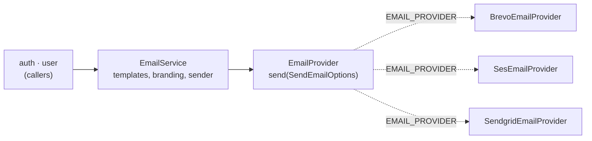

# Email providers

Transactional email leaves this system through exactly one provider, chosen per
deployment. This page records which providers exist, what each one costs the
caller, and the rule that keeps them interchangeable.

## The seam

`EmailService` owns templating, branding and the logo; it does not own sending.
Sending goes through one interface, so no caller anywhere names a vendor.

The dotted edges are alternatives, not additions: `emailProviderFactory` reads
`EMAIL_PROVIDER` and binds one implementation to the `EMAIL_PROVIDER` token.
`EmailModule` exports `EmailService` and nothing else, so the provider is
unreachable from outside the module — which is what makes it swappable.

## Who owns what

| Concern                                    | Owner                              |
| ------------------------------------------ | ---------------------------------- |
| Handlebars templates, brand context, logo  | `EmailService`                     |
| Recipient normalisation                    | `EmailService`                     |
| The shared sender address (`EMAIL_SENDER`) | `EmailService` reads and passes on |
| A provider-specific sender override        | that provider                      |
| Vendor SDK, error mapping, missing-sender  | that provider                      |

The third and fourth rows are the subtle ones. `EmailService` passes whatever
`EMAIL_SENDER` holds — including nothing — and each provider decides whether it
can send. SendGrid accepts `SENDGRID_SENDER` instead, because a project moving
onto SendGrid usually has to verify a different address there and may hold no
shared sender at all. An earlier version rejected an empty `EMAIL_SENDER` in the
service and made that impossible.

## The providers

| Provider   | Credentials                             | Notes                                                |
| ---------- | --------------------------------------- | ---------------------------------------------------- |
| `brevo`    | `EMAIL_API_KEY`                         | The default.                                         |
| `ses`      | the `AWS_*` keys the media module needs | Adds no new secrets. Sender must be verified in SES. |
| `sendgrid` | `SENDGRID_API_KEY`                      | `SENDGRID_SENDER` overrides the shared sender.       |

`SendEmailOptions` carries no attachments. An earlier draft offered them, and
SES could not honour it — `SendEmailCommand` does not carry attachments, only
`SendRawEmailCommand` with hand-assembled MIME does. Rather than ship an
interface one implementer refuses, the field was dropped: nothing in this
codebase emails an attachment. Adding them back means widening the interface
_and_ choosing providers that can all satisfy it.

## Adding a provider

Four things, in the same change, or the generator cannot remove it — see
[ADR 0005](../../adr/0005-region-anchored-module-generator.md):

1. An implementation of `EmailProvider` under `src/modules/email/providers/`.
2. A member in `EmailProviderEnum`, inside its own
   `// #region emailProvider:<key>` anchor pair.
3. An import and a `case` in `email-provider.factory.ts`, each inside that same
   anchor pair.
4. An entry in `EMAIL_PROVIDERS` in `scripts/modules.manifest.mjs`, plus an
   anchored block in `.env.example` for any keys it introduces.

Nothing checks step 2 or 3. A provider added without anchors ships in every
generated project regardless of what was chosen, and the failure is invisible
until someone wonders where it came from.

## Where a bad provider name is caught

`utils/email-env.validation.ts`, at `ConfigModule` load — the same place and the
same shape as the JWT startup gate in `auth`. An `EMAIL_PROVIDER` naming a
provider this build was generated without stops the app before it listens,
rather than surfacing hours later as an unsent password reset.

A blank or missing value is not an error: the factory falls back to whichever
provider the build kept. Both sides read the value with `||` rather than `??`,
because a blank env line arrives as `""`, and `??` would keep it — the validator
would approve the file and the factory would then refuse to boot on it.

Putting the check there rather than in the factory also keeps
`nestjs/no-raw-http-exception` intact: env validators already throw plain
`Error`s and are already exempt, so no rule needed changing.
