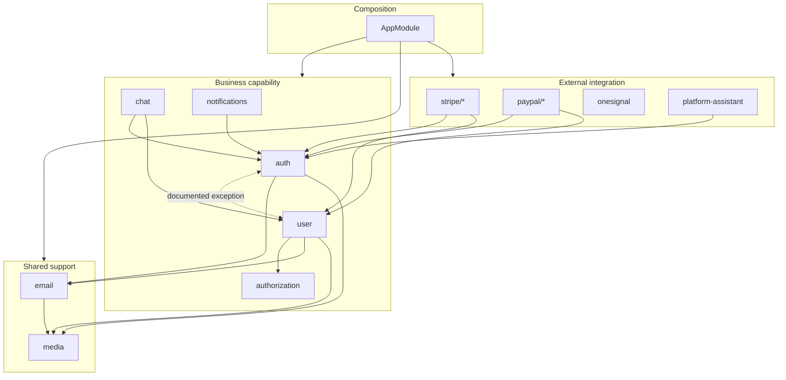

# Module ownership and dependency rules

Two questions this document exists to answer, before any code is written:

1. **Which module owns this behaviour?**
2. **Which dependencies are allowed?**

Every architectural question left unanswered here is one an agent — human or
otherwise — has to answer again on every task, and different answers are how a
codebase drifts. The [agent-first contract](../../README.md#agent-first-engineering-philosophy)
explains the why; this is the map.

Scope: this documents and constrains the module structure that exists. It does
not require Hexagonal Architecture, DDD, CQRS, repository layers, or a folder
migration.

## The map



Three categories, and they are about _reasoning_, not folders — nothing needs
relocating to fit one:

| Category                 | What it is                                    | Modules                                                   |
| ------------------------ | --------------------------------------------- | --------------------------------------------------------- |
| **Business capability**  | Owns domain behaviour and the data behind it  | `auth`, `user`, `chat`, `notifications`                   |
| **Shared support**       | A reusable capability with no domain opinions | `email`, `media`                                          |
| **External integration** | Wraps one third-party provider                | `stripe/*`, `paypal/*`, `onesignal`, `platform-assistant` |

## Ownership

For each module: what belongs, what does not, and what it exposes.

### `auth` — credentials, identity, and access decisions

**Owns** the authentication boundary and tenant context: the Passport
strategy, the global access guard, `@Public()`, `@TenantScoped()` and
`OrganizationAccessGuard`,
access-token signing, refresh sessions, password-reset credentials, OTP
issuance and verification, and the request-context decorators (`@GetUser`,
`@GetOrganizationId`) that read what its guards establish.

**Does not own** the user record itself — that is `user`. Auth reads the
`User` model for credential checks and membership, but profile CRUD, roles as
data, and account lifecycle belong next door.

**Exposes** `AuthService`, `TokenService`, `RefreshTokenService`,
`PasswordResetService`, `JwtStrategy`, `OrganizationAccessGuard`. Guards and
decorators are imported directly by path; they are part of the public surface.

Detail: [`authentication.md`](./security/authentication.md), [`ADR 0001`](../adr/0001-authentication-boundaries.md).

### `authorization` — what an identified caller may do

**Owns** the permissions _mechanism_: ability construction, the
`@RequirePermissions` route guard, record-level assertions, and the registry
domain policies register with. See
[`security/authorization.md`](./security/authorization.md) and
[ADR 0003](../adr/0003-casl-canonical-authorization-engine.md).

**Does not own** any rule. Policies live in the module that owns the data —
`user` decides what may be done to a user. It carries no domain vocabulary at
all: `AuthorizationContext.principal.role` is a `string`, not `USER_ROLES`,
which is what keeps it out of a `user → authorization → auth → user` cycle.

**Exposes** `PermissionsGuard`, `AuthorizationService`, `AbilityFactory`,
`PolicyRegistry`, `@RequirePermissions`, `@GetAbility`, and the `Action` enum.
`@Global`, because the guard is applied by controllers throughout the app and
nothing here holds state.

### `user` — the account record

**Owns** the `User` schema, profile CRUD, avatar handling, email-change flow,
and the role _value_ stored on an account.

**Does not own** how a caller proves who they are, or the permissions
mechanism. It owns the _rules_ about user records — `policies/user.policy.ts`,
the reference policy — and applies `PermissionsGuard` and
`OrganizationAccessGuard` without implementing either.

**Exposes** `UserService`.

### `chat` — rooms, messages, and read state

**Owns** chat rooms, messages, unread counts, and the WebSocket gateway.

**Does not own** user identity. It queries the `User` collection for
participant validation and user search — a documented cross-module read, noted
as debt below.

**Exposes** the focused services (`ChatRoomService`, `ChatMessageService`,
`ChatUnreadService`), not one general-purpose `ChatService`.

### `notifications` — in-app notifications and delivery

**Owns** notification records, per-user read state, and the SSE stream.

**Does not own** push delivery (`onesignal`) or email delivery (`email`).

**Exposes** the focused services (`NotificationService`,
`NotificationReadService`, `NotificationStreamService`).

### `email` — template rendering and delivery

**Owns** provider selection (SES / Brevo / SendGrid), Handlebars templates,
and sending. **Does not own** _when_ an email is sent or what it says
domain-wise — the calling module decides that and passes the data.

**Exposes** `EmailService`.

### `media` — object storage

**Owns** S3 presigning and deletion. **Does not own** what a file means to the
domain. **Exposes** `MediaService`.

### `stripe/*`, `paypal/*` — payment providers

Each is a thin base module exporting the SDK client, plus sub-feature modules
(`payment`, `subscription`, `invoice`, `webhook`).

**Own** everything provider-shaped: SDK calls, webhook signature verification,
provider ID mapping. **Do not own** application concepts that outlive the
provider. Webhook endpoints are `@Public()` and authenticate by signature.

### `onesignal` — push delivery

**Owns** the OneSignal SDK. **Exposes** `OneSignalService`.

### `platform-assistant` — portable LLM assistant

Self-contained and project-agnostic by design; configured through env and its
`context/` folder. It brings its own `ConfiguredAuthGuard` and is marked
`@Public()` so the global guard defers to it. **Do not** wire application
services into it — its whole value is copying out unchanged.

## Dependency rules

1. **Controllers call services in their own module.** A controller may use
   another module's _contract_ — guards, decorators, DTOs, constants — but not
   its internals: services, gateways, and private helpers are off limits.
   Reaching for one means the boundary is in the wrong place.
2. **Provider SDKs stay in their module.** `stripe`, `@paypal/*`, `@aws-sdk/*`,
   `@getbrevo/brevo`, `@onesignal/*`, `openai`, `socket.io`, `jsonwebtoken`,
   `bcrypt`, `otplib` are each confined to exactly one module today, and that
   is enforced — including subpath imports such as `stripe/lib/stripe`.
3. **Do not import another module's schema for convenience.** Needing another
   module's data is a signal to call its service. Where a direct read is
   genuinely right, it is listed as an exception below. Re-exporting a schema
   through an intermediate file does not launder it — the check follows
   `export … from '*.schema'` too.
4. **Cross-module dependencies express a capability need** — "I need to send
   email" — not "that file happened to have what I wanted".
5. **Two modules should not depend on each other.** One documented exception
   exists (`auth ↔ user`); adding a second needs an ADR, not a `forwardRef`.
6. **`forwardRef` is not an architecture.** It is an escape hatch for a cycle
   you have decided to keep. Prefer removing the cycle. Every current use is
   baselined — in modules and in providers, since `@Inject(forwardRef(...))`
   inside a service is the more common form — so the count can fall but not
   rise unnoticed.
7. **Shared helpers are not a dumping ground.** `src/utils`, `src/types`,
   `src/constants`, `src/guards` hold dependency-free code and may import no
   feature module. Anything that only makes sense alongside a module lives
   _in_ that module — which is why `@GetUser` moved into `auth`.
   (`src/scripts` is exempt: seeding and maintenance scripts are applications
   in their own right.)
8. **`AppModule` composes and nothing else.** No business providers, no
   orchestration.
9. **Export the capability, not the internals.** A module's `exports` is its
   contract; keep it to what others genuinely need.

## Optional modules and the generator

New projects are generated from this repository rather than cloned and pruned
by hand — see [ADR 0005](../adr/0005-region-anchored-module-generator.md). Which
modules a generated project can leave out is not a preference; it follows from
rule 5 above and from the import graph.

**Core — always present.** These are imported by other modules, not only by
`AppModule`, so removing one produces a project that does not compile:

| Module          | Imported by             |
| --------------- | ----------------------- |
| `auth`          | six modules             |
| `user`          | five modules            |
| `media`         | `auth`, `email`, `user` |
| `email`         | `auth`, `user`          |
| `authorization` | `stripe`, `user`        |

**Optional — selectable at generation.** Nothing but `AppModule` (and the
region-tagged halves of `src/scripts/seed.ts`) imports these: `stripe`,
`paypal`, `chat`, `notifications`, `onesignal`, `platform-assistant`.

That list is a consequence of the dependency rules, not a separate decision. A
module becomes optional by being decoupled, not by being added to the manifest.

### The obligation on a new module

Adding an optional module means adding, in the same change:

1. An entry in `scripts/modules.manifest.mjs` — folders, anchor tag, npm
   dependencies, and any `dependsOn`.
2. `// #region module:<key>` / `// #endregion module:<key>` anchors around every
   line that belongs to it in the shared files: `src/app.module.ts`,
   `src/constants/config.constant.ts`, `src/scripts/seed.ts`, and
   `.env.example` (which uses the `# #region` form).

**Nothing enforces step 2.** `scripts/setup.mjs` refuses to run on _unbalanced_
anchors, but it cannot detect anchors that were never written — a module added
without them silently appears in every generated project regardless of what was
ticked. This is listed as debt in ADR 0005; until it is checked mechanically,
it is a convention held up by review.

## Where does this change go?

| Change                                | Home                                                             |
| ------------------------------------- | ---------------------------------------------------------------- |
| New HTTP endpoint                     | Controller of the owning module                                  |
| New business rule                     | Focused service in the owning module                             |
| New Mongo schema                      | The module that owns that data                                   |
| External provider call                | That provider's integration module                               |
| Authentication / authorization        | `auth` — see [`authentication.md`](./security/authentication.md) |
| Reusable validation                   | The DTO, via `class-validator`                                   |
| Sending an email                      | Call `EmailService`; the template lives in `email`               |
| File upload / download                | Call `MediaService`                                              |
| Cross-module workflow                 | The module that owns the _outcome_, calling others' services     |
| Truly generic, dependency-free helper | `src/utils`, `src/types`, `src/constants`                        |

If two modules both look like the owner, the owner is the one that would have
to change if the rule changed.

## Known exceptions and debt

Listed so they read as decisions, not as patterns to copy.

### 1. `auth ↔ user` is a permitted cycle

`auth` needs the `User` model and `USER_ROLES`; `user` needs the guards,
decorators and password hashing. The two are always generated together and are
mutually defining — credentials without an account record mean nothing.

**Status:** accepted, baselined. Do not "fix" it with more `forwardRef`; if it
is ever broken, that is an ADR.

### 2. `AuthModule` and `UserModule` each declare `UserService` themselves

Rather than `AuthModule` importing `UserModule`, both list `UserService` (and
`MediaService`, `EmailService`) in `providers`. Nest therefore builds separate
instances — harmless while these services are stateless, wrong the moment one
caches anything.

**Status:** debt. The fix is a one-directional import once the cycle above is
resolved.

### 3. Payment and chat schemas reference the `User` schema directly

`stripe/card`, `stripe/subscription`, `paypal/subscription` and `chat` import
`User` to declare `ref` relationships on their own schemas — a Mongoose
idiom rather than a business dependency.

**Status:** debt, baselined per file. Harmless today; the fix is a shared
`ref` constant so the schema type is not the coupling point.

### 4. `chat` reads the `User` collection directly

`ChatService` queries users for participant validation and search rather than
calling `UserService`.

**Status:** debt, narrow and deliberate. Baselined so it cannot spread.

### 5. Clearing `emailVerified` leaves no way to re-verify

`UserService.changeEmail` and `update` both set `emailVerified: false` when the
address changes, but leave `status` as `ACTIVE`. Signup verification is the only
path that sets `emailVerified: true`, and it refuses anything that is not
`PENDING` — so once an active user changes their address, the flag stays false
with no route to flip it back.

Harmless today because nothing gates on `emailVerified` for an active account.
It becomes a live bug the moment something does.

**Status:** pre-existing debt, unchanged by the M2 work. Wants either a
re-verification flow or a decision that the flag means nothing after signup.

### 6. Two user routes carry no permission at all

`POST /users` and `GET /users` have never had a role or permission check — any
authenticated caller may create a user or list every user. The CASL migration
(ADR 0003) preserved behaviour rather than changing it, so they are still open.

**Status:** debt, and the more serious of the items here. Adding
`@RequirePermissions` to both is a small change with a real behaviour impact,
so it wants its own issue and its own review.

### 7. Payment controllers resolve the user from the request payload

Stripe and PayPal handlers take the user from the body instead of the
authenticated principal. They are authenticated now (the global guard covers
them), but they should read `@GetUser`.

**Status:** debt. See `src/modules/paypal/README.md`.

### 8. The notifications SSE stream identifies its subscriber by route param

`EventSource` cannot send an `Authorization` header, so the stream is
`@Public()` and trusts `:userId`.

**Status:** known hole, explicitly marked. The fix is a short-lived stream
ticket minted by an authenticated endpoint.

### 9. `ChatGateway` trusts a client-supplied `userId`

The WebSocket handshake performs no verification.

**Status:** known hole, flagged in the gateway. Must be closed before
production.

### 8. Most modules answer errors with HTTP 200

Outside `auth`, a failure returns `SerializeHttpResponse(null, 4xx, …)` — an
envelope carrying the status in its body while the response itself is `200`.
The auth module was converted to real status codes; chat, notifications,
Stripe and PayPal were not, because #13 explicitly required preserving HTTP
contracts during a refactor.

**Status:** debt, and the larger of the remaining items — it means a client
cannot rely on the HTTP status anywhere but `auth`. Converting it is a
breaking change for every consumer and wants its own issue.

## Enforcement

These rules are checked, not merely written down:

```bash
pnpm run architecture:check      # the check itself (also stage 5 of `verify`)
pnpm run architecture:baseline   # re-record after resolving one; refuses to add
pnpm run architecture:accept     # explicitly accept a documented new exception
pnpm run architecture:test       # the checker's own tests
```

It reports new module cycles, forbidden cross-module reads, and provider-SDK
leakage, with the dependency path that caused each and what the expected
direction is. It also runs as stage 5 of `pnpm run verify` and in CI.

Existing exceptions live in `architecture-baseline.json`. Entries are keyed by
**file**, not by rule — so a new file cannot inherit an existing exception, and
the list can shrink but never grows on its own. After genuinely resolving one:

```bash
pnpm run architecture:baseline   # re-records what is left
```

Recording a _new_ exception is a deliberate act: document it above first, then
regenerate. See [`quality-gate.md`](../quality-gate.md).
