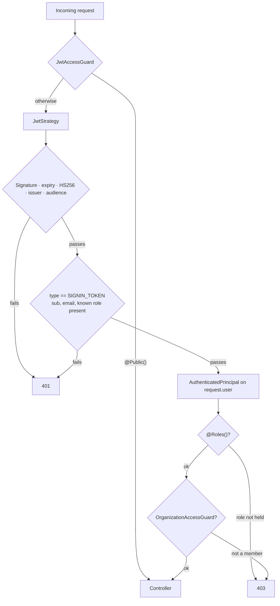
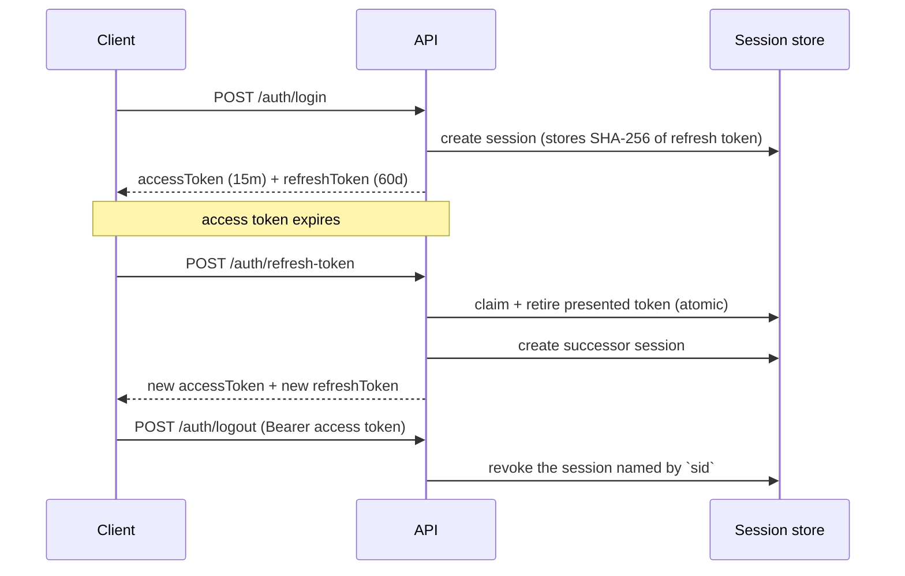
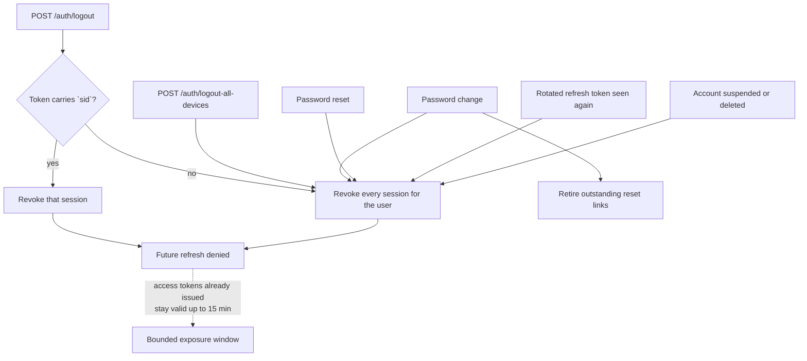
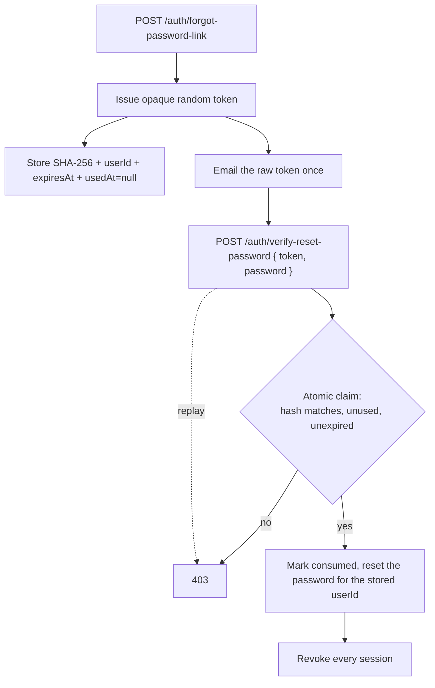
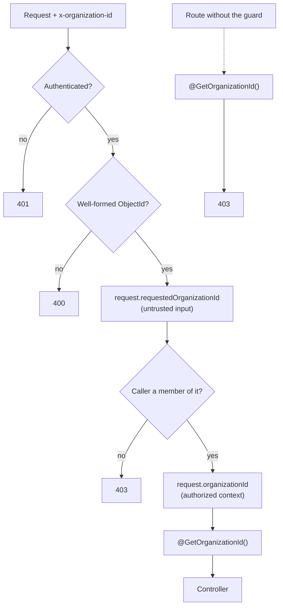

# Authentication & authorization

How a request proves who it is here, what it is then allowed to do, and where
each of those decisions lives. The reasoning behind the design is in
[ADR 0001](../../adr/0001-authentication-boundaries.md); this page is the working
reference.

## The request path



No step on that path reads the user collection.

## Who owns what

| Concern                         | Lives in                              | May read the database |
| ------------------------------- | ------------------------------------- | --------------------- |
| Verify the access token         | `strategies/jwt.strategy.ts`          | No                    |
| Decide if a route needs auth    | `guards/jwt-access.guard.ts`          | No                    |
| Mint access tokens              | `services/token.service.ts`           | No                    |
| Role authorization              | `guards/roles.guard.ts`               | No                    |
| Tenant authorization            | `guards/organization-access.guard.ts` | **Yes**               |
| Sessions: issue, rotate, revoke | `refresh-token.service.ts`            | Yes                   |
| Reset credentials               | `services/password-reset.service.ts`  | Yes                   |
| Login / signup orchestration    | `auth.service.ts`                     | Yes                   |

## The authenticated principal

`JwtStrategy.validate()` is the only producer. Everything downstream reads this
shape and nothing else.

```ts
type AuthenticatedPrincipal = {
  id: string;
  email: string;
  role: USER_ROLES;
  sessionId?: string;
};
```

Read it with `@GetUser()` or `@GetUser('id')`.

## Access tokens

```json
{
  "sub": "507f1f77bcf86cd799439011",
  "email": "user@example.com",
  "role": "ADMIN",
  "type": "SIGNIN_TOKEN",
  "sid": "507f1f77bcf86cd799439099",
  "iss": "nestjs-backend",
  "aud": "nestjs-api",
  "exp": 1234567890
}
```

15-minute TTL, HS256. Every claim listed is checked — see the table in
[ADR 0001 §4](../../adr/0001-authentication-boundaries.md).

JWT payloads are **encoded, not encrypted**. Anyone holding the token can read
every claim, so only what the authorization boundary actually consumes goes in.

## Writing a new route

Authentication is on by default. A new controller needs nothing:

```ts
@Controller('reports')
@ApiTags('Reports')
@ApiBearerAuth()
export class ReportsController {
  @Get() // already authenticated
  list(@GetUser('id') userId: string) {}

  @Get('summary')
  @Roles(USER_ROLES.ADMIN) // 403 if the role is missing
  @UseGuards(RolesGuard)
  summary() {}

  @Get('org')
  @TenantScoped() // the guard stands aside without this
  @UseGuards(OrganizationAccessGuard) // 403 unless a member
  forOrg(@GetOrganizationId() organizationId: string) {}

  @Public() // opt out, visibly
  @Get('health')
  health() {}
}
```

`@Public()` is for endpoints reached before a credential exists (signup, login,
password reset), endpoints authenticated by something other than a bearer token
(provider webhooks verify a signature header), and health checks. Anything else
should not carry it.

## Token lifecycle



Refresh tokens rotate on every use. Presenting an already-rotated one revokes
**every** session for that user — see [ADR 0001 §6](../../adr/0001-authentication-boundaries.md).

### Revocation



| Event                       | Effect                                                                                                                                                                                                                                                           |
| --------------------------- | ---------------------------------------------------------------------------------------------------------------------------------------------------------------------------------------------------------------------------------------------------------------- |
| Logout                      | Revokes the session named by `sid` in the access token. If a token carries no `sid` — it predates the session model, or was minted outside `issueSession` — logout revokes **every** session for that user rather than reporting success having revoked nothing. |
| Logout all devices          | Revokes every session for the user                                                                                                                                                                                                                               |
| Password change             | Revokes every session, retires outstanding reset links, and retires unredeemed OTPs of both kinds — see `services/credential-revocation.service.ts`                                                                                                              |
| Password reset              | Same as password change — sessions, reset links, and unredeemed OTPs                                                                                                                                                                                             |
| Account suspended / deleted | Refresh is refused and remaining sessions revoked at the next attempt                                                                                                                                                                                            |

In every case, access tokens already issued stay valid until they expire — at
most 15 minutes.

## Password reset



Two things this deliberately does not do:

- **It does not accept an email.** `VerifyResetPasswordDto` has no such field,
  and the global `whitelist: true` validation pipe strips one if sent, so it
  never reaches the handler. The account comes from the consumed record: the
  credential and the identity it authorizes come from the same place.
- **It does not put the token in a JWT.** Single-use is server-side state.

Never log a raw reset token or a full reset URL — either is a working password
reset for that account.

## Tenancy

`x-organization-id` is an assertion by the caller.

- `request.requestedOrganizationId` — what they asked for. Untrusted.
- `request.organizationId` — what they were found entitled to. Written only by
  `OrganizationAccessGuard`, read only via `@GetOrganizationId()`.



Without the guard, `@GetOrganizationId()` returns 403 rather than `undefined`.
An empty tenant filter turns "scoped to my organization" into "scoped to
everything", so failing is the safe answer.

## Configuration

| Key          | Required | Notes                                          |
| ------------ | -------- | ---------------------------------------------- |
| `JWT_SECRET` | Yes      | ≥ 32 chars. The app refuses to boot otherwise. |

Generate one with:

```bash
openssl rand -base64 48
```

Non-secret parameters (`ACCESS_TOKEN_VALIDITY`, `JWT_ISSUER`, `JWT_AUDIENCE`,
`JWT_ALGORITHM`, reset and refresh TTLs) live in
[`src/constants/config.constant.ts`](../../../src/constants/config.constant.ts).

## What CI enforces

Lint rules in `tools/eslint-rules/rules/auth.mjs`. Each bans a pattern that was
real code here before M1:

| Rule                                | Bans                                                  |
| ----------------------------------- | ----------------------------------------------------- |
| `nestjs/no-direct-jwt-verify`       | A second token-verification path                      |
| `nestjs/no-direct-jwt-sign`         | Minting tokens outside `TokenService`                 |
| `nestjs/no-db-in-access-auth`       | A model injected into a strategy or access/role guard |
| `nestjs/no-legacy-auth-guard`       | Referencing the deleted `JwtAuthGuard`                |
| `nestjs/no-raw-organization-header` | Reading the tenant header outside its guard           |
| `nestjs/no-manual-bearer-parsing`   | Hand-rolled `Authorization` parsing                   |
| `nestjs/one-access-strategy`        | A second Passport JWT strategy                        |

### What the rules cannot catch

They are static checks, so they see syntax, not behaviour. Known limits:

- Indirection defeats them — re-exporting `verify` from another module, or
  taking a reference (`const f = jwt.verify`) before calling it.
- A different JWT library (`jose`, say) is not in the allow-list of names.
- A guard that delegates its lookup to an injected **service** reads the
  database without naming a model.

The last one is covered behaviourally instead: the authorization e2e asserts
the user collection is read **zero** times across an authenticated request
(`userModelReads.count`), which fails however the read is spelled. Treat the
lint rules as the fast feedback and that assertion as the real guarantee.

Contract tests live in [`test/auth/`](../../../test/auth/) and run without a
database — which is itself part of the contract.

```bash
pnpm run lint:check                                  # architecture rules
pnpm test                                            # unit specs
pnpm run test:e2e -- test/auth                       # HTTP contract
```

## Where new auth behaviour belongs

Before adding to this stack, find the row that matches what you are doing:

| You want to…                      | Put it in                                              | Not in                          |
| --------------------------------- | ------------------------------------------------------ | ------------------------------- |
| Change what makes a token valid   | `strategies/jwt.strategy.ts` + `isAccessTokenClaims()` | a guard, a controller           |
| Add a claim to the access token   | `services/token.service.ts` + `AccessTokenClaims`      | the call site that needs it     |
| Add a permission rule             | a new authorization guard                              | `JwtStrategy`, `JwtAccessGuard` |
| Change session/logout behaviour   | `refresh-token.service.ts`                             | the controller                  |
| Change reset-credential behaviour | `services/password-reset.service.ts`                   | `auth.service.ts`               |
| Make a route anonymous            | `@Public()` on that route                              | removing a guard                |
| Add a second credential type      | **an ADR first**                                       | a second strategy               |

If your change means relaxing one of the lint rules above, that is the signal
to write an ADR rather than to edit the rule.

## Breaking changes for clients

> Client-side integration detail — interceptors, token storage, the rotation
> hazard — lives in
> [`docs/frontend-auth-integration.md`](../../frontend-auth-integration.md). This
> section is the wire contract it is derived from.

The M1 rewrite changed the wire contract. Frontends must be updated.

| Before                                                               | Now                                                                                                                |
| -------------------------------------------------------------------- | ------------------------------------------------------------------------------------------------------------------ |
| `{ token, user }` from login and signup-OTP verification             | `{ accessToken, refreshToken, expiresIn, refreshExpiresIn, user }`                                                 |
| Token valid 7 days                                                   | Access token valid 15 minutes; refresh via `POST /auth/refresh-token`                                              |
| `POST /auth/logout` with `{ refreshToken }`                          | `POST /auth/logout` with the access token only                                                                     |
| `POST /auth/verify-reset-password` with `{ email, password, token }` | `{ password, token }` — a supplied `email` is stripped by the global validation pipe and never reaches the handler |
| Reset link `?token=…&email=…`                                        | `?token=…`                                                                                                         |
| `x-organization-id` accepted as tenant context                       | Membership is verified; non-members get 403                                                                        |

| Auth failures answered `200 OK` with the status in the body | The auth module answers real HTTP statuses — `401` for bad credentials, `403` for a spent reset token, `429` for OTP cooldown. Clients that read `body.status` must read the HTTP status instead. |

Refresh tokens rotate, so a client must store the new `refreshToken` from every
refresh response. Reusing the previous one revokes all of that user's sessions.

> **Scope note.** Only the auth module was converted. Other modules (chat,
> notifications, Stripe, PayPal) still return `200` with an error status in the
> body. That is pre-existing debt, tracked separately — not a signal that the
> two conventions are both acceptable in new code.
