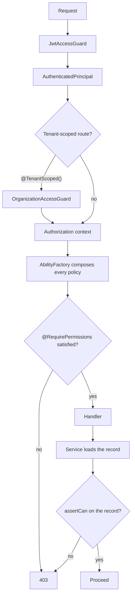

# Authorization

What an identified caller may do. Authentication answers _who_ — see
[`authentication.md`](./authentication.md); this answers _what_.

Rationale and rejected alternatives: [ADR 0003](../../adr/0003-casl-canonical-authorization-engine.md).
Day-to-day instructions: [`docs/guides/permissions.md`](../../guides/permissions.md).

## The request path



## Ownership

| Concern                  | Lives in                                    | Reads the database |
| ------------------------ | ------------------------------------------- | ------------------ |
| Ability construction     | `authorization/ability.factory.ts`          | No                 |
| Route enforcement        | `authorization/guards/permissions.guard.ts` | No                 |
| Record-level assertion   | `authorization/authorization.service.ts`    | No                 |
| **The rules themselves** | `<module>/policies/*.policy.ts`             | No                 |

The split is the point. The authorization module never learns which domain
modules exist — policies register themselves with `PolicyRegistry` — so adding
a feature never means editing it.

Policies must be pure: read the context, add rules, return. `PermissionsGuard`
runs every policy on every guarded request, so a policy that awaits something
makes authorization as slow as its slowest rule.

## Vocabulary

**Action** — `Manage`, `Create`, `Read`, `Update`, `Delete`, `List`. `Manage`
is CASL's wildcard and matches every other action.

`List` is separate from `Read` because callers who may browse a directory
often may not open an arbitrary entry — exactly the split this codebase
already had between `GET /users/all` and `GET /users/:id`.

**Subject** — a name (`'User'`) declared by the module that owns the data, or
a record tagged with one via CASL's `subject()`.

**Ability** — the composed rule set for one caller. Built per request,
attached to `request.ability`, reachable in a controller via `@GetAbility()`.

## Two stages, and why both are required

The route guard runs before anything is loaded, so it can only answer
questions about the caller. Questions about a record are asked by the service
that loaded it.

This is not defence in depth. **CASL's name-only check ignores conditions:**

```ts
can('read', 'User', { _id: 'me' });

ability.can('read', 'User'); // true  — nothing to test
ability.can('read', subject('User', { _id: 'x' })); // false — record excluded
```

A caller who may read only their own record still passes a guard that checks
the subject _name_. Without the record-level assertion, "read your own
profile" silently becomes "read every profile".

Rule of thumb: **if a policy attaches a condition to a subject, every route
reading a single record of that subject needs `assertCan`.**

`AuthorizationService.assertCan` refuses when handed no ability, so a route
missing `PermissionsGuard` fails closed rather than reading as permitted.

## Field-level rules

A grant can name the fields it covers:

```ts
can(Action.Update, USER_SUBJECT, ['name', 'phone'], { _id: principal.id });
```

Without this, "edit your own profile" also means "make yourself an OWNER": the
record-level check passes because the record _is_ theirs, and an unfiltered DTO
carries `role` straight through. Callers pass the fields they are writing to
`assertCan`, which refuses if any falls outside the grant.

A grant with no field list covers every field, so field checks are inert until
a policy narrows one.

## Statelessness, and what it costs

`PermissionsGuard` reads nothing from the database. Abilities are built from
token claims and already-authorized tenant context, inheriting ADR 0001 §5.

The consequence, plainly: **a role change takes effect when the caller's
current access token expires — up to 15 minutes.** Anything needing immediate
effect must revoke the refresh sessions and accept the same bounded window.

Tenant membership is the deliberate exception. It is per-user mutable state a
short-lived token cannot speak for, so `OrganizationAccessGuard` reads it —
separately, after identity is settled, and only on routes marked
`@TenantScoped()`.

**Ordering matters and Nest only respects it within a single `@UseGuards`.**
Controller-level guards run before route-level ones, so a tenant guard applied
per route runs _after_ `PermissionsGuard` and the ability is built with
`organizationId: undefined` — every tenant-conditioned rule silently evaluating
against nothing. Declare both at controller level, in order:

```ts
@UseGuards(OrganizationAccessGuard, PermissionsGuard)
export class UserController {
  @Get('all')
  @TenantScoped()          // the tenant guard stands aside without this
  @RequirePermissions({ action: Action.List, subject: USER_SUBJECT })
```

## 401 and 403

- **401** — no identity, or an untrustworthy one. Re-authenticating may help.
- **403** — identity established, action not permitted. Re-authenticating
  cannot help.

Every refusal returns the same message whatever the caller lacked. Naming the
missing permission tells someone probing the API which door to try next.

## Forbidden patterns

| Do not                                              | Instead                                            |
| --------------------------------------------------- | -------------------------------------------------- |
| Add a new role guard for business rules             | Write a policy                                     |
| Put `@Roles(...)` on a new route                    | `@RequirePermissions(...)`                         |
| Check roles inside a service                        | Take an `AppAbility` and `assertCan`               |
| Read the database in a policy or `PermissionsGuard` | Put the claim in the token, or check after loading |
| Pass a request into a service for authorization     | Pass the `AppAbility`                              |
| Use a raw `x-organization-id` in a policy           | Use `context.organizationId`                       |

## Testing

Every policy needs: allow, deny, elevated role, and unknown role — plus
ownership wherever the policy conditions a grant on the record, which is where
the coarse-check trap lives. `src/modules/user/policies/user.policy.spec.ts` is
the reference, including a test pinning the coarse-check behaviour so a future
policy change cannot quietly make a route guard sufficient on its own.

A policy with no record conditions — `subscription-plan.policy.ts`, where a
plan has no owner — has no ownership case to write, and its route needs no
`assertCan`. Test the breadth of its grant instead.

Contract tests live in [`test/authorization/`](../../../test/authorization/)
and run without a database, which is itself part of the contract.

## Current state

Policies, and the subjects they rule on:

| Module                | Subject            | Policy                                    |
| --------------------- | ------------------ | ----------------------------------------- |
| `user`                | `User`             | `policies/user.policy.ts` — the reference |
| `stripe/subscription` | `SubscriptionPlan` | `policies/subscription-plan.policy.ts`    |

`SubscriptionPlan` covers creating a plan, which creates a Product and Price in
the Stripe account and publishes them to every caller of
`GET /stripe/subscriptions/plans` — an operator action, granted to OWNER and
ADMIN. Reading the catalogue declares no permission and is unchanged: any
authenticated caller may list plans.

The grant is `Action.Create`, not `Manage`. `Manage` would pre-authorize
editing and retiring plans before either route exists, and the spec pins that
so a later widening has to be deliberate.

Not migrated: `@Roles` and `RolesGuard` are deprecated but retained so an
adopter's routes keep working. Nothing in `src/` still applies them.

Deliberately unguarded, unchanged by this work: `POST /users` and
`GET /users` carry no permission today. Adding one would change behaviour, and
this migration preserved it. Tracked as debt in
[`module-architecture.md`](../module-architecture.md).
