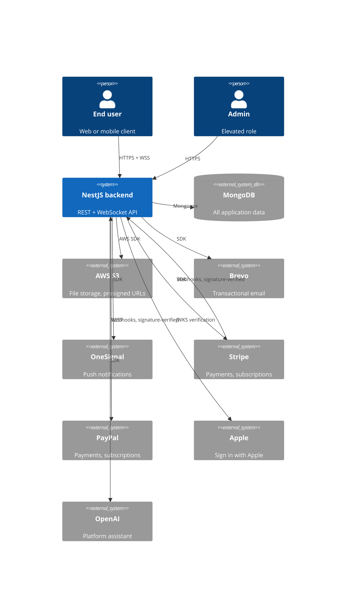

# System context

What this system is, who talks to it, and what it depends on. C4 level 1 — the
outermost view, before any module appears.

## What it is

A NestJS backend starter kit: a REST API plus a WebSocket gateway over MongoDB,
with authentication, chat, notifications, media storage, and two payment
providers already wired in.

It is a **boilerplate**. Modules are meant to be deleted as often as extended,
which is why boundaries are enforced mechanically
([`module-architecture.md`](./module-architecture.md)) rather than by
convention.

## The context

## External dependencies

Derived from `package.json` and the modules that own each SDK — see the
provider-ownership rule in
[`module-architecture.md`](./module-architecture.md).

| System    | Used for                | Owned by                              | Via                               |
| --------- | ----------------------- | ------------------------------------- | --------------------------------- |
| MongoDB   | All persistence         | every module owns its own collections | `mongoose`                        |
| AWS S3    | Uploads and downloads   | `media`                               | `@aws-sdk/client-s3`              |
| Brevo     | Transactional email     | `email`                               | `@getbrevo/brevo`                 |
| OneSignal | Push notifications      | `onesignal`                           | `@onesignal/node-onesignal`       |
| Stripe    | Payments, subscriptions | `stripe/*`                            | `stripe`                          |
| PayPal    | Payments, subscriptions | `paypal/*`                            | plain `fetch` — no SDK dependency |
| Apple     | Sign in with Apple      | `auth`                                | `jwks-rsa`                        |
| OpenAI    | Platform assistant      | `platform-assistant`                  | `openai`                          |

Every one of these is confined to a single module, and that confinement is
enforced by `nestjs/provider-sdk-leak` in `pnpm run architecture:check`. Two
modules importing the same SDK means neither owns it.

## Inbound traffic

| Channel               | Authentication                                                                                                                                               |
| --------------------- | ------------------------------------------------------------------------------------------------------------------------------------------------------------ |
| REST                  | Bearer access token by default; `@Public()` opts a route out                                                                                                 |
| WebSocket (`chat`)    | **None.** The handshake trusts a client-supplied `userId` — a known hole, see [`module-architecture.md`](./module-architecture.md#known-exceptions-and-debt) |
| SSE (`notifications`) | Route param, not a token. `EventSource` cannot send headers — same debt list                                                                                 |
| Provider webhooks     | Signature header, verified in the handler. Marked `@Public()` because there is no bearer token to send                                                       |

See [`security/authentication.md`](./security/authentication.md).

## What is deliberately absent

- **No API gateway, service mesh, or queue.** One process, one database.
- **No caching layer.** Authentication needs none by design; nothing else has
  needed one yet.
- **No multi-region or replication strategy.** Deployment is left to the
  project that adopts this kit.

These are noted so their absence reads as a decision rather than an oversight.
Adding any of them is an [ADR](../adr/README.md).
