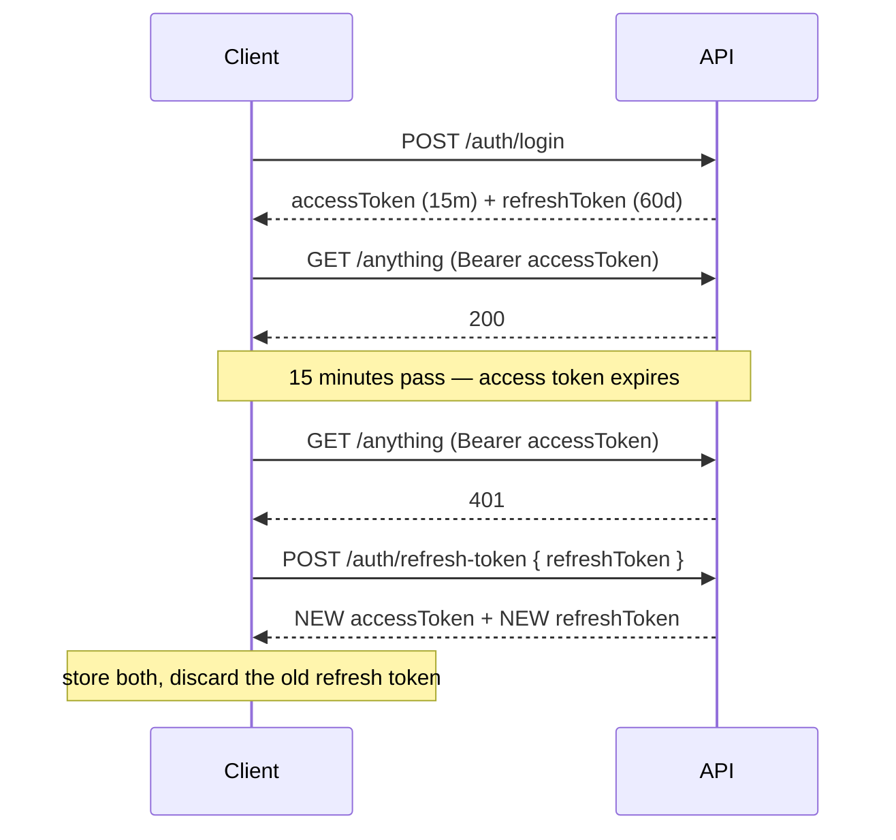

# Auth API — frontend integration guide

Everything a client needs to sign users in and keep them signed in. Auth only —
other modules are out of scope.

Base path: `/auth`. Interactive reference: `/api-docs`.

- Why the design is what it is: [`docs/architecture/security/authentication.md`](architecture/security/authentication.md)
  and [ADR 0001](adr/0001-authentication-boundaries.md).
- Every other module's endpoints: [`docs/fe-api-guide.md`](fe-api-guide.md).
- Server-side reference for these routes: [`src/modules/auth/README.md`](../src/modules/auth/README.md).

This page is the client's view: the wire contract, and the handful of things
that will break a client if it gets them wrong.

> **This replaces an older contract.** If you are updating an existing client
> rather than writing a new one, read [What changed](#what-changed) first — the
> login response shape, token lifetime and error handling all moved.

---

## Setup

```ts
// Same origin in dev via a proxy; an absolute URL in production.
export const API_BASE = import.meta.env.VITE_API_BASE ?? '';
```

- **Content type.** Every request below sends JSON: set
  `Content-Type: application/json` and `JSON.stringify` the body. Unknown
  fields are stripped rather than rejected, so a stale client will not 400 on
  a field the server no longer wants.
- **CORS.** The API runs with CORS enabled and does not use cookies for auth,
  so no `credentials: 'include'` is needed — the bearer token is the whole
  story. If you move the refresh token into an httpOnly cookie behind your own
  BFF, that BFF holds the credential, not this API.
- **On app boot / page refresh.** You will have a stored refresh token and
  possibly a stale access token. Do not call `/auth/refresh-token` eagerly on
  every load — that burns a rotation. Make your first real request and let the
  401 interceptor refresh if it needs to.

## The model in one minute

Two credentials, doing different jobs:

|          | Access token                    | Refresh token                               |
| -------- | ------------------------------- | ------------------------------------------- |
| What     | Signed JWT                      | Opaque random string                        |
| Lifetime | **15 minutes**                  | 60 days                                     |
| Sent as  | `Authorization: Bearer <token>` | Request body, to `/auth/refresh-token` only |
| Purpose  | Every authenticated request     | Getting a new access token                  |

The access token is short-lived because it cannot be revoked once issued;
the refresh session **can** be, which is where logout and session control live.

`expiresIn` (`"15m"`) and `refreshExpiresIn` (`"60d"`) come back as strings for
display. Do not parse them to schedule a pre-emptive refresh — refresh
reactively, on a 401. A timer drifts when the tab sleeps, and refreshing early
just spends rotations.

**Refresh tokens rotate.** Every refresh returns a _new_ refresh token and
invalidates the one you sent. Store the new one immediately — see
[the rule that will bite you](#the-one-rule-that-will-bite-you).



---

## Response envelope

Every response is wrapped:

```json
{ "data": ..., "status": 200, "message": "Human-readable text" }
```

`message` is intended for display, though nothing guarantees every message is
phrased for end users — treat it as a default, not a promise.

### Test success with `res.ok`, not `res.status === 200`

The envelope's `status` and the HTTP status **do not always agree on success.**
No handler sets an explicit code, so Nest applies its defaults: a successful
`POST` is **HTTP 201** while the body still reads `"status": 200`. Only
`/auth/apple/callback` sets its status explicitly.

```ts
if (!res.ok) {
  /* handle failure */
} // correct: 200 and 201 both pass
if (res.status === 200) {
  /* ... */
} // wrong: every successful POST is 201
```

So: **`res.ok` for success, `res.status` for the failure reason.** This
mismatch is known debt on the backend side, not something to design around.

### Failures use real HTTP status codes

Check `res.status` / catch the rejection — do **not** branch on the body.

| Status | Meaning                                                                  |
| ------ | ------------------------------------------------------------------------ |
| `400`  | Bad input (validation), or a request that cannot be fulfilled            |
| `401`  | Not authenticated: no token, bad token, expired token, wrong credentials |
| `403`  | Authenticated but not allowed — or a spent/expired reset token           |
| `404`  | Account not found                                                        |
| `409`  | Conflicts with existing state — the email is already registered          |
| `429`  | OTP requested again too soon                                             |
| `500`  | Server error                                                             |

### One inconsistency to code around

**Validation errors use `msg`, not `message`**, and add `success`:

```jsonc
// 400 from class-validator (malformed email, missing field, short password)
{ "msg": "email must be an email", "status": 400, "success": false, "data": null }

// 401 from application logic
{ "message": "Incorrect email or password.", "status": 401, "data": null }
```

Read both:

```ts
const text = body.message ?? body.msg ?? 'Something went wrong';
```

Do not rely on `success` — only validation failures set it.

---

## Endpoints

`Auth: no` means no `Authorization` header is needed.

| Method | Path                               | Auth    | Purpose                                        |
| ------ | ---------------------------------- | ------- | ---------------------------------------------- |
| POST   | `/auth/signup`                     | no      | Create an account, sends signup OTP            |
| POST   | `/auth/verify-signup-otp`          | no      | Verify OTP → **activates account and logs in** |
| POST   | `/auth/resend-signup-otp`          | no      | Resend the signup OTP                          |
| POST   | `/auth/login`                      | no      | Email + password                               |
| POST   | `/auth/refresh-token`              | no      | Exchange refresh token for a new pair          |
| POST   | `/auth/forgot-password`            | no      | Email an OTP for password reset                |
| POST   | `/auth/verify-forgot-password-otp` | no      | Verify OTP → returns a reset token             |
| POST   | `/auth/forgot-password-link`       | no      | Email a reset **link** instead of an OTP       |
| POST   | `/auth/verify-reset-password`      | no      | Set a new password using a reset token         |
| POST   | `/auth/apple/callback`             | no      | Sign in with Apple                             |
| GET    | `/auth/get-authenticated-user`     | **yes** | Current user's profile                         |
| POST   | `/auth/change-password`            | **yes** | Change password (requires current)             |
| POST   | `/auth/logout`                     | **yes** | End this session                               |
| POST   | `/auth/logout-all-devices`         | **yes** | End every session                              |
| GET    | `/auth/active-sessions`            | **yes** | List this user's live sessions                 |

### Sign up

```http
POST /auth/signup
{ "name": "Ada", "email": "ada@example.com", "phone": "+441234567890", "password": "correct-horse" }
```

`data: true`, envelope `status: 201`. No tokens yet: an OTP goes to the
address. The account is `PENDING` and **cannot log in** until verified.

`409` if the email is already registered — offer sign-in rather than a field error. Note there is **no minimum length on
`password` here** — enforce your own client-side rule if you want one.

### Verify signup OTP → logged in

```http
POST /auth/verify-signup-otp
{ "email": "ada@example.com", "otp": "123456" }
```

Returns the full session payload — this both activates the account and signs
the user in, so no separate login call is needed.

`403` — wrong, expired, or already-used OTP, or too many attempts.
`400` `Your account is already verified.` from `/auth/resend-signup-otp`
whenever the account is not pending verification — already verified, or
suspended. Only a pending account can be resent a signup code, because only a
pending account can redeem one.

### Log in

```http
POST /auth/login
{ "email": "ada@example.com", "password": "correct-horse" }
```

```jsonc
// envelope status 200 (HTTP 201 — see above)
{
  "data": {
    "accessToken": "eyJhbGciOiJIUzI1NiIs...",
    "refreshToken": "9f2c…128 hex characters",
    "expiresIn": "15m",
    "refreshExpiresIn": "60d",
    "user": { "_id": "...", "name": "Ada", "email": "ada@example.com",
              "role": "MEMBER", "status": "ACTIVE", ... }
  },
  "status": 200,
  "message": "Your account has been logged in successfully."
}
```

`401` `Incorrect email or password.` — also returned when the account exists but
is `PENDING`, `INACTIVE` or `UNAPPROVED`. Deliberately indistinguishable from a
wrong password, so the endpoint does not reveal which addresses are registered.

`user` never includes `password`. Optional fields such as `avatar` are
**absent** when unset, not `null` — use `user.avatar ?? fallback`.

The refresh token is 64 random bytes hex-encoded: a **128-character** string.
Size any storage column accordingly.

### Refresh

```http
POST /auth/refresh-token
{ "refreshToken": "<the one you stored>" }
```

Same payload shape as login, with a **new** `refreshToken`.

`401` — session invalid, revoked, or expired. Send the user to sign-in.

### Log out

```http
POST /auth/logout
Authorization: Bearer <accessToken>
```

No body. The session is identified from the access token, so a client cannot
end someone else's session by sending a different refresh token.

`/auth/logout-all-devices` ends every session for the user.

> Logging out revokes the **refresh session**. The current access token stays
> valid until it expires (≤ 15 minutes). Clear it client-side immediately.

### Password reset — two routes

**OTP flow**

```http
POST /auth/forgot-password              { "email": "ada@example.com" }
POST /auth/verify-forgot-password-otp   { "email": "ada@example.com", "otp": "123456" }
   → { "data": { "resetToken": "…" } }
POST /auth/verify-reset-password        { "token": "<resetToken>", "password": "new-password" }
```

**Link flow**

```http
POST /auth/forgot-password-link   { "email": "ada@example.com" }
```

Emails a link to `<FRONTEND_URL>/reset-password?token=…`. Read `token` from the
query string and post it to `/auth/verify-reset-password`.

**These endpoints `404` on an unknown email.** So do `/auth/forgot-password`
and `/auth/resend-signup-otp`. That is enumerable — unlike login, which
deliberately hides whether an address exists. Do not echo the 404 verbatim;
show the same "if that address exists, we've sent it" copy either way.

**There is no `email` field on `verify-reset-password`.** The account comes from
the token itself. Sending one is silently ignored.

Reset tokens are **single-use** and expire in 30 minutes. Using one twice
returns `403`. A successful reset revokes every session for that user, so the
client must send them to sign-in afterwards.

### Change password

```http
POST /auth/change-password
Authorization: Bearer <accessToken>
{ "currentPassword": "correct-horse", "newPassword": "battery-staple-42" }
```

`newPassword` must be at least 8 characters — this is the **only** password
field with a server-side length rule. `400` if the current password is wrong.

Succeeding **revokes every session, including this one**. Sign the user out and
back in, or immediately log in again with the new password.

### Current user

```http
GET /auth/get-authenticated-user
Authorization: Bearer <accessToken>
```

Returns the profile. Prefer the `user` object from login/refresh where you have
it — this is for refetching after a profile change.

### Active sessions

```http
GET /auth/active-sessions
Authorization: Bearer <accessToken>
```

`data` is an array of `{ _id, deviceInfo, ipAddress, createdAt, expiresAt }` —
enough for a "signed in on these devices" screen. There is no endpoint for
revoking a single session; `logout-all-devices` is the only lever.

### Sign in with Apple

```http
POST /auth/apple/callback
{ "idToken": "<Apple identity token>" }
```

`200` (existing user) or `201` (new account) with the standard session
payload — this endpoint sets its HTTP status explicitly, so here the code is
meaningful.

`400` if Apple's token does not verify. `401` `Incorrect email or password.`
if the matching account is disabled.

---

## The one rule that will bite you

**Every refresh returns a new refresh token, and the old one dies.**

Present an already-rotated refresh token and the server treats it as a stolen
credential: **every session for that user is revoked immediately**. That is
deliberate — a rotated token reappearing means two parties hold it.

Two ways clients trip this:

1. **Not storing the new token.** Persist it before doing anything else.
2. **Concurrent refreshes.** Three requests 401 at once, three refresh calls
   fire, one wins and two replay a dead token → the user is logged out
   everywhere.

Serialise refreshes behind a single in-flight promise, so concurrent 401s
produce one refresh call rather than a stampede:

```ts
type Tokens = { accessToken: string; refreshToken: string };

interface TokenStore {
  read(): Tokens | null;
  save(tokens: Tokens): void;
  clear(): void;
}

declare const store: TokenStore;
declare function redirectToLogin(): void;

/** Non-null only while a refresh is in flight. */
let inFlight: Promise<string> | null = null;

async function refresh(): Promise<string> {
  const current = store.read();

  if (!current) {
    redirectToLogin();
    throw new Error('not signed in');
  }

  const res = await fetch(`${API_BASE}/auth/refresh-token`, {
    method: 'POST',
    headers: { 'Content-Type': 'application/json' },
    body: JSON.stringify({ refreshToken: current.refreshToken }),
  });

  if (!res.ok) {
    store.clear();
    redirectToLogin();
    throw new Error('session expired');
  }

  const { data } = await res.json();
  // Both, always. Keeping the old refreshToken is what triggers the
  // reuse-detection that logs the user out everywhere.
  store.save({
    accessToken: data.accessToken,
    refreshToken: data.refreshToken,
  });
  return data.accessToken;
}

function getFreshAccessToken(): Promise<string> {
  // Callers arriving mid-refresh await the same promise. Cleared only after
  // it settles — and a rejected promise is cleared too, so a later attempt
  // can retry rather than await a permanently-failed one.
  inFlight ??= refresh().finally(() => {
    inFlight = null;
  });

  return inFlight;
}
```

### Interceptor

```ts
declare const API_BASE: string;

function withAuth(init: RequestInit, token: string): RequestInit {
  // `Headers` normalises every accepted shape; spreading `init.headers` into
  // an object literal silently drops a `Headers` instance or an array of
  // pairs — losing Content-Type on POSTs.
  const headers = new Headers(init.headers);
  headers.set('Authorization', `Bearer ${token}`);
  return { ...init, headers };
}

export async function authedFetch(
  path: string,
  init: RequestInit = {},
): Promise<Response> {
  const tokens = store.read();

  if (!tokens) {
    redirectToLogin();
    throw new Error('not signed in');
  }

  const first = await fetch(
    `${API_BASE}${path}`,
    withAuth(init, tokens.accessToken),
  );

  if (first.status !== 401) {
    return first;
  }

  // Exactly one retry. `refresh()` clears the store and redirects if the
  // session is genuinely gone, so a failure here does not come back.
  const retried = await fetch(
    `${API_BASE}${path}`,
    withAuth(init, await getFreshAccessToken()),
  );

  if (retried.status === 401) {
    store.clear();
    redirectToLogin();
  }

  return retried;
}
```

Retry a 401 **once**. If the retry also 401s the session is gone — do not loop.

### Two tabs are two `inFlight` promises

The pattern above serialises refreshes _within one tab_. Two tabs refreshing at
the same moment still race, and the loser replays a rotated token — which
revokes every session for that user.

If your app can be open in several tabs, coordinate across them. In rough order
of effort:

- Do refreshes in a **`SharedWorker`** or service worker, so there is one
  refresher per origin rather than per tab.
- Take a lock with **`navigator.locks.request('auth-refresh', …)`** around
  `refresh()` — a few lines, and widely supported.
- Broadcast the new tokens over a **`BroadcastChannel`** so other tabs adopt
  them instead of refreshing themselves.

Doing nothing is a legitimate choice for a single-tab admin tool. It is not one
for a consumer app.

## Storing tokens

The access token is short-lived; the refresh token is the valuable one — it is
a 60-day credential.

- Keep the refresh token out of `localStorage` if you can. An httpOnly cookie
  set by your own BFF is safest; if the SPA must hold it, accept that any XSS
  is a full account compromise.
- Keep the access token in memory where practical.
- Clear both on logout, on a failed refresh, and after a password change.

The access token is **signed, not encrypted** — anyone holding it can read its
claims. Decode it for display if you like, but never trust its contents for an
authorisation decision: the server re-checks every request, and a client-side
check is a UI hint at best.

---

## What changed

If you are updating an existing client. The authoritative list, including the
`x-organization-id` change that only affects tenant-scoped routes, is in
[`authentication.md`](architecture/security/authentication.md#breaking-changes-for-clients) —
this is the subset an auth integration has to act on.

| Before                                                      | Now                                                                |
| ----------------------------------------------------------- | ------------------------------------------------------------------ |
| `{ token, user }` from login and signup-OTP verification    | `{ accessToken, refreshToken, expiresIn, refreshExpiresIn, user }` |
| Token valid **7 days**                                      | Access token **15 minutes**; refresh to renew                      |
| No refresh flow in practice                                 | Refresh is required, and tokens rotate                             |
| `POST /auth/logout` with `{ refreshToken }`                 | No body — access token identifies the session                      |
| `verify-reset-password` took `{ email, password, token }`   | `{ password, token }` — `email` is ignored                         |
| Reset link `?token=…&email=…`                               | `?token=…`                                                         |
| Reset tokens reusable until expiry                          | Single-use                                                         |
| Auth errors returned **HTTP 200** with the code in the body | Real HTTP status codes                                             |

**The last row is the one that breaks silently.** Any client doing
`if (body.status === 401)` after a successful `fetch` will now never see the
error, because the request itself rejects. Move that logic to `res.ok` /
`res.status` before shipping.

Other modules (chat, notifications, payments) still return `200` with the
status in the body. Only `/auth` was converted.

---

## Quick reference

| Situation                          | Do                                             |
| ---------------------------------- | ---------------------------------------------- |
| `401` on any request               | Refresh once, retry once, then sign-in         |
| `401` from `/auth/refresh-token`   | Clear tokens, go to sign-in                    |
| `403` from `verify-reset-password` | Token spent or expired — request a new one     |
| `409` from `/auth/signup`          | Email taken — offer sign-in, not a field error |
| `429` from an OTP endpoint         | Show a cooldown; do not auto-retry             |
| After password change or reset     | Clear tokens and re-authenticate               |
| Reading an error message           | `body.message ?? body.msg`                     |
