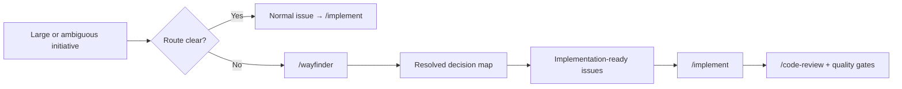
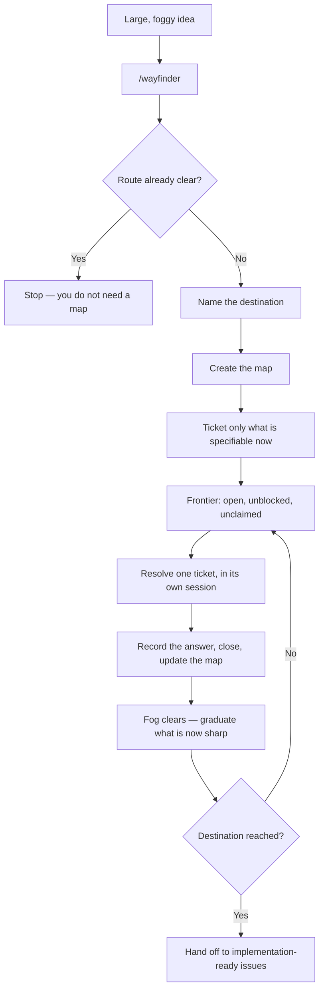
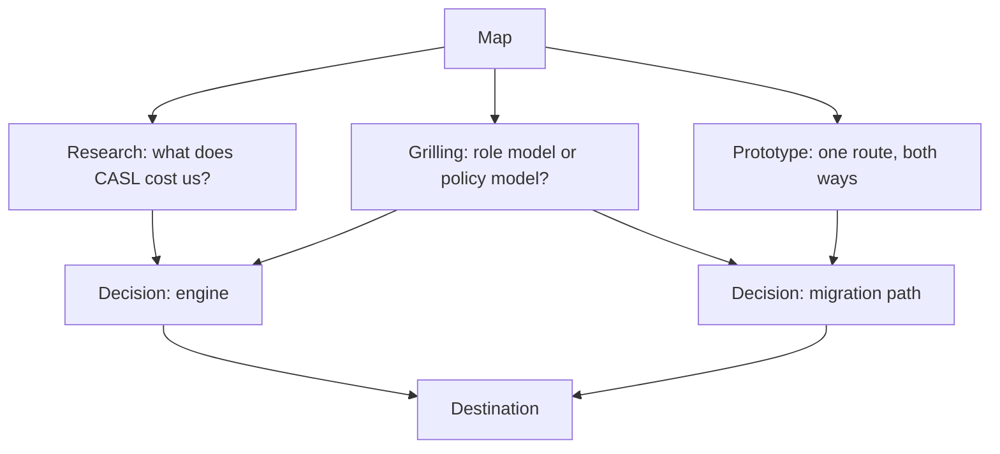

# Wayfinder — planning work that is too big to see the end of

For work where the **destination is clear but the route is not**. Wayfinder
charts the route as a map of decision tickets on GitHub Issues, then resolves
them one at a time until nothing is left to decide.

Enforcement-level rules: [`AGENTS.md`](../../AGENTS.md#use-wayfinder-when-the-route-is-not-clear).
The skill itself is vendored via `npx skills` — do not edit
[`.claude/skills/wayfinder/`](../../.claude/skills/wayfinder/SKILL.md) or fork it.

## When to use it

The test is not size. It is **whether making the issue implementation-ready
would require guessing a decision nobody has made.**

| Situation                                                                 | Use                         |
| ------------------------------------------------------------------------- | --------------------------- |
| Ownership, constraints and acceptance criteria are already clear          | Normal issue → `/implement` |
| Big, but only one sensible implementation path                            | Normal issue                |
| You cannot write the acceptance criteria without deciding something first | **Wayfinder**               |
| Several plausible architectures and no basis yet to choose                | **Wayfinder**               |
| More decisions than one agent session can hold                            | **Wayfinder**               |

M1 (auth hardening) did **not** need Wayfinder: the issues already said what
done looked like. "Introduce an authorization system" before CASL was chosen
would have — the engine, the policy model, and the migration path were all
open, and each depended on the previous.



## The mental model



The map is **deliberately incomplete**. Only questions you can state precisely
now become tickets; the rest stays as fog until an earlier decision sharpens
it.

## Vocabulary

| Term             | Means                                                          |
| ---------------- | -------------------------------------------------------------- |
| **Destination**  | What reaching the end looks like. Named first; fixes the scope |
| **Map**          | One issue labelled `wayfinder:map`. An _index_, not a store    |
| **Ticket**       | A child issue holding one decision, sized to a single session  |
| **Frontier**     | Open, unblocked, unclaimed tickets — what is takeable now      |
| **Fog**          | In-scope questions not yet sharp enough to ticket              |
| **Out of scope** | Ruled beyond the destination. Closed; never graduates          |

**Fog or ticket?** Can you state the question precisely _now_? Then ticket it,
even if it is blocked. If you cannot phrase it that sharply, it is fog. Do not
pre-slice fog into ticket-sized pieces — one patch may become three tickets or
none.

## Two ways to invoke it

Both are invoked with the effort itself: charting creates the map, working
through it takes the map as its argument.

### 1. Chart the map

```
/wayfinder migrate every module off the shared User collection
```

The agent grills you to name the destination, fans out breadth-first to find
the open decisions, creates the map, and creates **only the tickets it can
specify now** — then wires blocking edges in a second pass, because issues need
ids before they can reference each other.

It resolves nothing. Charting is one session's work.

If grilling surfaces **no fog**, you do not need a map. The agent stops and
says so.

### 2. Work through the map

Invoke with **the map** — URL or issue number:

```
/wayfinder https://github.com/Gok-boilerplates/nestjs-backend/issues/40
```

The agent loads the map and takes the first frontier ticket itself. Naming a
ticket is _optional_, and only narrows which one it picks — without one, the
agent chooses, not you.

Either way it **claims the ticket by assigning it to itself before doing any
work**, resolves it, posts the answer as a resolution comment, closes it, and
appends a one-line gist to the map's _Decisions so far_.

Fresh session per ticket, and **one non-research decision ticket per session**.
Research tickets are the exception and run in parallel.

## The four ticket types

| Label                 | Purpose                                            | Mode         |
| --------------------- | -------------------------------------------------- | ------------ |
| `wayfinder:research`  | Find a fact a decision waits on                    | Agent alone  |
| `wayfinder:prototype` | Build something cheap and concrete to react to     | With a human |
| `wayfinder:grilling`  | Resolve a decision through discussion. The default | With a human |
| `wayfinder:task`      | Prerequisite work blocking a decision              | Either       |

**Prototype tickets matter more than they look.** They are what stops a long
Wayfinder effort becoming low-feedback waterfall planning: a rough artifact you
can react to beats another paragraph of speculation.

A human-in-the-loop ticket only resolves through live exchange. An agent that
answers its own grilling questions has broken the point of it.

## Dependencies, not sequence

Blocking uses GitHub's **native issue dependencies**, so the frontier is
visible in GitHub's own UI without opening the map.



Independent frontier tickets can run in parallel, in separate sessions. Expect
other sessions to be editing the tracker while you work.

## How this repo expresses it

The `gh` commands for maps, child issues, blocking edges, frontier queries,
claiming and resolving are in
[`docs/agents/issue-tracker.md`](../agents/issue-tracker.md#wayfinding-operations).
That is the authority; this guide does not repeat them, so they cannot drift.

## Handing off

When the destination is reached, the map's _Decisions so far_ is the input to
the normal workflow: `/to-tickets` turns it into implementation-ready issues,
and `/implement` builds them.

Wayfinder is **not** a replacement for implementation tickets. It ends where
they begin.

## Rules that catch people out

- **Name the destination first.** Everything else is scoped by it.
- **Do not chart the whole project up front.** That is waterfall with extra
  steps. Fog is a feature.
- **Do not mix deciding with building.** The urge to just do it means you have
  reached the edge of the map.
- **Claim before working**, or two sessions resolve the same ticket.
- **The map gists; the ticket holds the detail.** A decision lives in exactly
  one place.
- **Do not fork or wrap the skill.** It updates through `npx skills` and
  `skills-lock.json`; a local copy stops receiving fixes.
